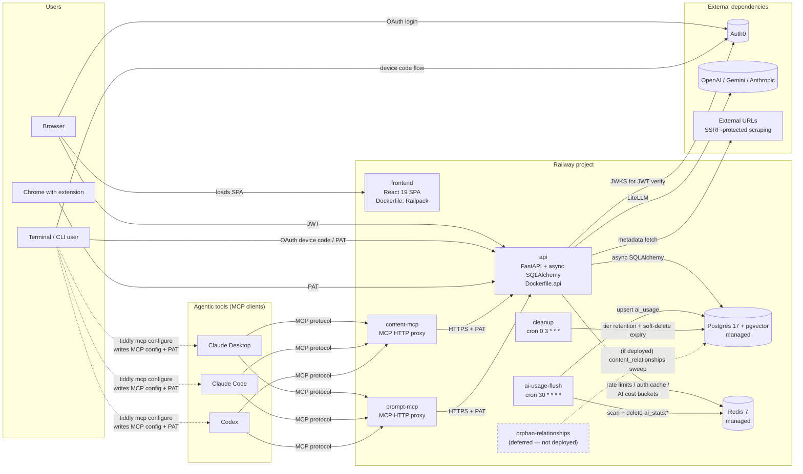

# Tiddly — Architecture

Start here for a system-level overview. Topic-specific deep dives live alongside this file in `docs/` and are linked inline. For conventions and coding rules, see `AGENTS.md`. For deployment specifics, see `README_DEPLOY.md`.

Tiddly is a multi-tenant SaaS for managing bookmarks, notes, and prompt templates, with AI-assisted metadata and first-class MCP integration for agentic tools. It is deployed as a small fleet of Railway services backed by managed Postgres and Redis.

---

## 1. System diagram

**Notes on the diagram:**

- The api service is the only process with direct database access. MCP servers and the CLI are clients of the api, not independent DB consumers.
- Redis fails open: if it's unavailable, rate limiting and auth caching degrade but the app still serves requests.
- `orphan-relationships` is implemented and documented in `README_DEPLOY.md`, but **intentionally not deployed** at current beta scale. See [KAN-67](https://tiddly.atlassian.net/browse/KAN-67) for the deferral rationale and §9 below.
- Dashed edges from CLI to the agentic tools represent `tiddly mcp configure` — a one-time local setup action where the CLI mints a PAT (via the api) and writes it into each detected tool's native config file (`claude_desktop_config.json`, `~/.claude.json`, `~/.codex/config.toml`). These are not runtime network protocols; they're filesystem writes on the user's machine that bootstrap the subsequent MCP-protocol edges.

---

## 2. Components

### Frontend — `frontend/`

- React 19.2 + Vite 7 + Tailwind CSS 4.1 + TypeScript 5.9, Node v22
- State: Zustand stores in `stores/` (per-domain: filters, settings, tags, tokens, consent, ai)
- Data fetching: TanStack React Query v5 with a shared `queryClient`; hooks grouped by domain (`useBookmarksQuery`, `useBookmarkMutations`, ...)
- Routing: React Router v7 with `createBrowserRouter`; top-level regions include the content views (`/bookmarks`, `/notes`, `/prompts`), settings, docs hub, and public marketing pages
- Editor: Milkdown (markdown) for notes/descriptions; CodeMirror with Nunjucks highlighting for prompt templates
- Auth: `@auth0/auth0-react` with offline-access refresh tokens; localStorage-backed; axios interceptor auto-retries on 401 with `cacheMode: 'off'`
- Error handling: axios response interceptor centralizes 401 (re-auth), 402 (quota), 429 (rate limit), 451 (consent required)
- Every request sends `X-Request-Source: web` for server-side audit/source detection

### API — `backend/src/`

- FastAPI with async SQLAlchemy 2.0 on Postgres 17 (pgvector), Python 3.13, dependencies managed by `uv`
- Entry point: `api/main.py`. Routers in `api/routers/`, services in `services/`, models in `models/`, schemas in `schemas/`
- PYTHONPATH is `backend/src`; imports are always relative to that root (never `from backend.src...`)
- Detailed breakdown of routers, services, auth, rate limiting, and LLM integration is in §4–§8 below

### MCP servers — `backend/src/mcp_server/` and `backend/src/prompt_mcp_server/`

Two independent MCP services that agentic tools (Claude Desktop, Claude Code, Codex) talk to via the MCP protocol. Both proxy through the api service over HTTPS using a user-supplied PAT; they hold no database credentials.

- **content-mcp** — bookmarks + notes: search, get, create, update, content-level edits (old_str/new_str patches), tag and filter listing, relationship creation. Local dev port: 8001.
- **prompt-mcp** — prompt templates: search, metadata/content fetch, create, update, content-level edits, tag/filter listing. Local dev port: 8002.

Both deliberately **do not expose delete**. Destructive operations are web-UI-only. Both are deployed as regular Railway services with public domains.

### CLI — `cli/` (Go + Cobra + Viper)

A thin REST client plus an MCP-setup assistant.

- Commands: `login`, `logout`, `auth`, `status`, `mcp configure|status|remove`, `skills configure|list`, `export`, `tokens`, `config`, `update`
- Auth: OAuth device-code flow (default) or `--token bm_...` for non-interactive use; credentials stored via `go-keyring` with a plaintext fallback at `~/.config/tiddly/credentials`
- Config: `~/.config/tiddly/config.yaml` (Viper-managed), `TIDDLY_*` env overrides
- **Primary non-obvious value:** `tiddly mcp configure` detects installed agentic tools on the host (by probing PATH and tool-specific config locations), generates scoped PATs, and writes the MCP server URLs into each tool's native config file (e.g. `claude_desktop_config.json`, `~/.claude.json`, `~/.codex/config.toml`). This is the "connect my Claude apps to Tiddly" onramp.
- Sends `X-Request-Source: cli` on every request

### Chrome extension — `chrome-extension/`

Manifest V3. Vanilla JS, no build step.

- Popup UI has two modes: **save** (on regular pages — URL, title, description, tag autocomplete, save to `/bookmarks/`) and **search** (on restricted pages like `chrome://*` — query + tag filters)
- Background service worker relays API calls; options page manages the PAT
- PAT stored in `chrome.storage.local`; on every request sets `Authorization: Bearer <token>` and `X-Request-Source: chrome-extension`
- Hardcoded `API_URL = https://api.tiddly.me` in `background-core.js`; 15s timeout via AbortController

### Background jobs — `backend/src/tasks/`

| Script | Deployed? | Schedule | Responsibility |
|---|---|---|---|
| `ai_usage_flush.py` | Yes | `30 * * * *` | Scan Redis `ai_stats:*` hashes for *past* hours, upsert aggregated rows into `ai_usage`, delete processed keys. Excludes the current hour to preserve in-flight writes. Upsert uses SET (not INCREMENT) so re-runs are idempotent. |
| `cleanup.py` | Yes | `0 3 * * *` | Tier-based `content_history` retention, permanent deletion of soft-deleted entities older than 30 days (with their history, via app-level cascade), and orphaned-history sweep. |
| `orphan_relationships.py` | **Deferred** | — | Detect (and optionally delete) rows in `content_relationships` whose polymorphic source/target entity no longer exists. Documented in README_DEPLOY.md for future deploy but not running today. See [KAN-67](https://tiddly.atlassian.net/browse/KAN-67). |

Each cron runs as its own Railway service with its own schedule and failure mode. None shares a pipeline or depends on another.

**Cron schedules are set in Railway's per-service Deploy settings, not in the Python task files.** Grepping the repo for `30 * * * *` or similar will come up empty — the schedule lives in the deployed service config. This is by design (keeps task code decoupled from when/how it's invoked), but worth knowing before you go hunting.

### External dependencies

- **Auth0** — JWT issuer for web login (RS256, custom email claim namespace `https://tiddly.me` matching the Post-Login Action); also the device-code endpoint for CLI login.
- **OpenAI / Google Gemini / Anthropic** — LLM providers accessed via LiteLLM. Only `OPENAI_API_KEY` is required today (platform default for suggestions is `openai/gpt-5.4-nano`). Gemini/Anthropic keys are optional until more AI use cases ship.
- **External URLs** — the api scrapes target URLs for bookmark metadata (`services/url_scraper.py`), wrapped in SSRF protection (see §10).

---

## 3. Request flow — example: create a bookmark with AI tag suggestions

A realistic happy-path walkthrough touching most of the moving parts:

1. **Browser → Frontend.** React SPA loads. Auth0 session supplies a JWT.
2. **Browser → api: `POST /bookmarks/`** with bearer JWT and `X-Request-Source: web`.
3. **Auth layer** (`core/auth.py`): verifies the JWT signature against cached JWKS (1-hour TTL), resolves `auth0_id` → user via the Redis auth cache (5-min TTL) with DB fallback, attaches a `RequestContext` to `request.state` for audit, checks that the user has accepted current policy versions (else HTTP 451).
4. **Rate limiter** (`core/rate_limiter.py`): looks up the user's tier → `WRITE` limits; consults Redis sliding-window + daily Lua script; rejects with 429 + `Retry-After` if over. Redis-backed; fails open on Redis outage.
5. **BookmarkService.create**: validates URL uniqueness (partial unique index on `(user_id, url)` for non-deleted rows), enforces tier quota + field-length limits, inserts the row with a UUIDv7 PK. A DB trigger updates the `search_vector` tsvector for FTS.
6. **Optional: URL scrape.** If the client requested metadata fetch, `services/url_scraper.py` validates the target (`validate_url_not_private()` blocks RFC1918, loopback, link-local; resolves hostnames to prevent DNS rebinding) and fetches title/description.
7. **Response.** Body serialized; `ETagMiddleware` generates a weak ETag; `RateLimitHeadersMiddleware` emits `X-RateLimit-*` headers from `request.state.rate_limit_info`.
8. **Follow-up: AI tag suggestions.** Browser calls `POST /ai/suggest-tags`. Auth flow repeats (this time the AI-specific rate limit bucket — `AI_PLATFORM` or `AI_BYOK` depending on whether an `X-LLM-Api-Key` header is present).
9. **LLMService** resolves the config (`AIUseCase.SUGGESTIONS` → `openai/gpt-5.4-nano` + platform key, or user-model + user-key for BYOK). Calls LiteLLM's `acompletion()`. On success, records cost + count into Redis via `HINCRBY` + `HINCRBYFLOAT` on key `ai_stats:{user_id}:{hour}:{use_case}:{model}:{key_source}` with a ~7-day TTL. Never logs prompts, completions, or API keys.
10. **Hourly flush.** At the next `:30`, the `ai-usage-flush` cron scans Redis, aggregates completed hours, and upserts into `ai_usage`. The `ai_usage_analytics` view (SHA-256-pseudonymized `user_hash`) makes these rows safe to expose to a scoped read-only analytics role.

---

## 4. Data model — entities and key patterns

### Core entities (`models/`)

All inherit `UUIDv7Mixin` (time-sortable PK), `TimestampMixin` (`created_at`, `updated_at` server-side), and most inherit `ArchivableMixin` (`deleted_at`, `archived_at`).

| Model | Notes |
|---|---|
| `User` | Auth0 `auth0_id` + email + `tier`. One-to-many cascade to bookmarks, notes, prompts, api_tokens. |
| `Bookmark` | URL + title/description/summary/content. Trigger-maintained `search_vector`. Partial unique index on `(user_id, url)` for non-deleted rows. |
| `Note` | Title + markdown content/description. Trigger-maintained `search_vector`. |
| `Prompt` | Jinja2 template `name` + title/description/content + JSONB `arguments`. Trigger-maintained `search_vector`. Partial unique index on `(user_id, name)` for active prompts. |
| `Tag` | User-scoped; many-to-many via `bookmark_tags`, `note_tags`, `prompt_tags` junctions. |
| `ContentHistory` | Unified versioning for all three entity types (polymorphic `entity_type` + `entity_id`). Reverse diffs via diff-match-patch; snapshots every 10th version; JSONB `metadata_snapshot`. Audit events (delete/undelete/archive/unarchive) have `version=NULL`. |
| `ContentRelationship` | Polymorphic, bidirectional canonical ordering. `source_id` and `target_id` are plain UUIDs — **no FK constraint** (see below). |
| `AiUsage` | Hourly buckets `(bucket_start, user_id, use_case, model, key_source)` with `request_count` + `total_cost`. Unique constraint on all five. |
| `ApiToken` | PAT with `bm_` prefix; stored as SHA-256 hash + 12-char plaintext prefix for display/audit. |
| `UserConsent`, `UserSettings`, `ContentFilter`, `FilterGroup` | Supporting models for policy tracking, preferences, saved views. |

### Cross-cutting data patterns

- **Multi-tenant scoping is application-level, not RLS-enforced.** Every query in every service filters by `user_id`. There is no Postgres row-level security — the invariant is maintained by the service layer. This is the single most important architectural invariant to preserve.
- **Soft delete everywhere.** Rows are removed from list/search results via `deleted_at`. A nightly cron (`cleanup`) eventually hard-deletes rows older than 30 days along with their history records.
- **Archiving is separate from soft delete.** `archived_at` is a user-facing "hide from default views" state; items remain queryable. Both mixin columns are indexed.
- **Time-sortable UUIDv7** primary keys throughout. Allows natural chronological ordering without a separate `created_at` index in most queries.
- **Trigger-maintained FTS vectors.** Bookmarks/Notes/Prompts each have a `search_vector` TSVECTOR column that a Postgres trigger keeps up to date on insert/update (weighted: title/name=A, description/summary=B, content=C). GIN indexed. Migration: `c07d5e217ca3_add_search_vector_columns_triggers_gin_*`.
- **pgvector** is enabled on the Postgres cluster, reserved for future embedding-based features.

### Versioning — `content_history`

Single table covering all three entity types. Every content change produces a `ContentHistory` row: a reverse diff (diff-match-patch delta from new → old) plus a JSONB `metadata_snapshot`. Every 10th version stores a full snapshot instead of a diff so reconstruction cost is bounded. Audit-only events (delete, restore, archive, unarchive) are stored with `version=NULL`. Retention is tier-based (see §11).

Deeper treatment: [`docs/content-versioning.md`](content-versioning.md).

### Polymorphic relationships — `content_relationships`

Designed to link any entity type to any other. Because `source_type`/`target_type` can point to three different tables, a traditional `FOREIGN KEY ... ON DELETE CASCADE` is impossible. Cleanup is done in application code inside `BaseEntityService.delete()`, which calls `relationship_service.delete_relationships_for_content(...)` in the same transaction as the entity delete.

There is a real `ON DELETE CASCADE` FK on `content_relationships.user_id` → `users.id`, so user deletion *does* cascade.

Relationships are bidirectional with canonical ordering (no duplicate "A → B" and "B → A" rows). A unique constraint on `(user_id, source_type, source_id, target_type, target_id, relationship_type)` enforces this.

---

## 5. Authentication, consent, and request identity

**Two authentication flows** converge in `core/auth.py`:

1. **Auth0 JWT** for the web SPA. RS256 verification against cached JWKS (1-hour TTL). `auth0_id`, `email`, `email_verified` read from the token, with custom email claims under the `AUTH0_CUSTOM_CLAIM_NAMESPACE` prefix (set by the Auth0 Post-Login Action — see README_DEPLOY.md Step 6d).
2. **Personal Access Tokens (PAT)** for CLI, MCP servers, Chrome extension, and scripts. Format: `bm_<random>`. Validated by `TokenService` against `api_tokens.token_hash` (SHA-256). A 12-char plaintext `token_prefix` is stored for UI display and audit.

**Request identity resolution** (per request):

1. Parse `Authorization: Bearer <token>`.
2. If prefixed `bm_`, route to PAT validation. Otherwise treat as Auth0 JWT.
3. Resolve to a `User` row via the Redis auth cache (5-min TTL), falling back to DB and repopulating cache.
4. Attach a `RequestContext(source, auth_type, token_prefix)` to `request.state` for downstream audit logging.
5. Enforce **consent**: authenticated routes (except the consent endpoints themselves and `/health`) check that the user has accepted current privacy-policy and terms versions. Mismatch returns HTTP 451 with instructions; the frontend opens a consent dialog. Skipped in `DEV_MODE`.
6. Apply the matching **rate limit** bucket (see §6).

**DEV_MODE bypass**: set `VITE_DEV_MODE=true` locally. Creates a synthetic user (`auth0_id="dev|local-development-user"`) without any auth header. Settings validation refuses to let DEV_MODE coexist with a non-local database as a safety guard.

**Auth variants exported from `core/auth.py`:**

- `get_current_user` — full flow: auth + rate limit + consent
- `get_current_user_without_consent` — for the consent-accept endpoint itself
- `get_current_user_auth0_only` — rejects PATs (403). Used where Auth0 session is semantically required.
- `get_current_user_auth0_only_without_consent` — Auth0-only AND skips the consent gate. Used on the consent-accept endpoint when PATs must also be rejected (a user accepting the policy cannot do so via a CLI token).
- `get_current_user_ai` — Auth0-only, no *global* rate limit. AI endpoints apply a separate `AI_PLATFORM`/`AI_BYOK` bucket.

---

## 6. Rate limiting

Implemented in `core/rate_limiter.py` + `core/rate_limit_config.py`.

**OperationType buckets** (distinct Redis keys, distinct limits):

| Bucket | Covers |
|---|---|
| `READ` | List, search, get |
| `WRITE` | Create, update, delete |
| `SENSITIVE` | PAT management, account settings |
| `AI_PLATFORM` | AI endpoints using platform API keys |
| `AI_BYOK` | AI endpoints using a user-supplied `X-LLM-Api-Key` (counted separately from platform) |

Each bucket has both a **per-minute** sliding window (Redis sorted set of timestamps) and a **per-day** fixed window (incremented via Lua script). Limits are tier-scoped. Tiers with `0/0` limits for a bucket (FREE and STANDARD both have `0/0` for `AI_PLATFORM` and `AI_BYOK`, today) short-circuit without even hitting Redis — only PRO has non-zero AI limits.

`GET /ai/health` exposes remaining quota in **both** windows — `remaining_per_minute` / `limit_per_minute` alongside `remaining_per_day` / `limit_per_day` — plus `resets_at`, the absolute UTC timestamp when the daily counter expires (derived from the key's Redis TTL; `null` when no counter exists yet). Clients can show either an absolute time or a derived countdown; absolute is immune to staleness from cached queries. A dedicated `AIRateLimitStatus` dataclass in `core/rate_limiter.py` wraps the three values; the minute window is peeked non-destructively via `ZCOUNT` (exclusive lower bound to mirror the writer's `ZREMRANGEBYSCORE` semantics), and the TTL read goes through a dedicated `RedisClient.ttl()` wrapper that normalizes Redis's `-2`/`-1`/positive sentinels into `int | None`. The entire peek is fail-open: any Redis failure resolves to "full quota remaining" (and `resets_at: null`) to avoid false 429s on the status endpoint. The daily counter uses a per-user fixed window: Redis `INCR` with an 86400-second `EXPIRE` set only on the first increment, so each user's window starts at their first request after the previous key expired — not a shared UTC-midnight reset.

Results are stored in `request.state.rate_limit_info` and serialized to `X-RateLimit-Limit`, `X-RateLimit-Remaining`, `X-RateLimit-Reset`, and (when exceeded) `Retry-After` response headers.

**Fail-open semantics**: if Redis is unreachable, the limiter logs a warning and allows the request rather than hard-failing. This is intentional — Redis downtime should degrade, not break, the API. It also means rate limits are effectively **per-instance** when Redis is absent; multi-instance deployments without Redis would allow per-instance quota. Currently the deployed topology is a single API instance, so this is a non-issue, but worth knowing before horizontally scaling.

---

## 7. LLM integration

Implemented in `services/llm_service.py` using LiteLLM.

### Use cases and defaults

| `AIUseCase` | Default model | Status |
|---|---|---|
| `SUGGESTIONS` | `openai/gpt-5.4-nano` | **Wired up**: suggest-tags, suggest-metadata, suggest-relationships, suggest-arguments |
| `TRANSFORM` | `gemini/gemini-flash-lite-latest` | Defined, not yet wired to an endpoint |
| `AUTO_COMPLETE` | `gemini/gemini-flash-lite-latest` | Defined, not yet wired |
| `CHAT` | `openai/gpt-5.4-mini` | Defined, not yet wired |

Defaults are overridable per-use-case via `LLM_MODEL_*` env vars. The current `/ai/models` endpoint returns 7 GA models (OpenAI nano/mini/flagship, Anthropic Haiku/Sonnet/Opus, Gemini Flash Lite). Gemini Flash and Gemini Pro are defined but commented out due to chronic provider 503s — see `evals/LEARNINGS.md`.

### Platform vs BYOK

`LLMService.resolve_config(use_case, user_api_key, user_model)`:

- If `user_api_key` is supplied (BYOK), the request uses the user's key, and the user may also pass their own `user_model` (validated against `_SUPPORTED_MODEL_IDS`).
- If no user key, the server uses its own platform key for the use case. **In platform mode, the user's requested `user_model` is ignored** — platform callers are locked to the use-case default. This is deliberate: it keeps platform cost deterministic and prevents arbitrary-model abuse.

### Cost tracking

Each successful completion:

1. Computes cost via LiteLLM's `completion_cost(completion_response=...)` (public API — never touch `_hidden_params`, which is private and unstable across versions).
2. Writes a Redis hash keyed `ai_stats:{user_id}:{hour}:{use_case}:{model}:{key_source}` with fields `count` (`HINCRBY`) and `cost` (`HINCRBYFLOAT`). TTL ~7 days as a safety net.
3. Emits a structured info log with metadata (user_id, use_case, model, key_source, cost, latency). **Never** logs prompts, completions, or API keys.

The `ai-usage-flush` cron aggregates these buckets into the `ai_usage` table every hour, processing only *past* hours so it never loses in-flight writes. The `ai_usage_analytics` Postgres view adds a SHA-256 `user_hash` pseudonymization layer for analytics tools; a read-only `analytics_reader` role grants SELECT on the view only.

### Spend protection

There is no application-level circuit breaker. Cost containment relies on **provider-side monthly spend caps** configured in each provider dashboard (OpenAI billing, Google AI Studio, Anthropic console). Required for every provider whose platform key is set on the api service. See [README_DEPLOY.md Step 8a](../README_DEPLOY.md#8a-provider-spend-caps-required).

### Errors

LiteLLM exceptions propagate; a shared exception handler registered on the AI router maps them to typed HTTP responses (`llm_auth_failed` → 422, `llm_rate_limited` → 429, `llm_timeout` → 504, `llm_bad_request` → 400, `llm_connection_error` → 502, `llm_parse_failed` → 502, other → 503). All use the `llm_*` prefix so the frontend can distinguish provider failures from platform auth failures. `llm_parse_failed` is raised by `services/suggestion_service.py::LLMParseFailedError` when the provider returns a response that doesn't match the expected structured-output schema — clients should retry, ideally with a different model.

Deeper treatment: [`docs/ai-integration.md`](ai-integration.md).

---

## 8. Redis responsibilities

One Redis instance, three independent uses. All fail-open.

| Purpose | Keys | Notes |
|---|---|---|
| **Rate limiting** | Per-user sliding-window sorted sets + daily counters | Enforced via Lua for daily atomic increment. Fail-open logs a warning and permits the request. |
| **Auth cache** | User-by-auth0-id and user-by-token-hash hashes | 5-minute TTL. Invalidated on email/consent-version change; falls through to Postgres. |
| **AI cost buckets** | `ai_stats:{user_id}:{hour}:{use_case}:{model}:{key_source}` hashes | Written by `LLMService` after each call; flushed to `ai_usage` hourly by cron. ~7-day TTL. |

**What gets lost if Redis restarts:** current-minute rate-limit quotas reset (users briefly un-throttled), auth cache cold-starts (slightly slower requests for 5 minutes), and any AI cost bucket written since the last successful flush. None of these are catastrophic; they're operational annoyances, not data-correctness events.

---

## 9. Background jobs (operational)

Summary of the three cron services — full deployment details in README_DEPLOY.md.

### `ai-usage-flush` (every hour at `:30`)

- Scans Redis for `ai_stats:*` keys
- Filters to hours strictly earlier than the current hour (never processes in-flight buckets)
- Upserts aggregated rows into `ai_usage` via `ON CONFLICT DO UPDATE SET` (SET, not INCREMENT — safe to re-run the same bucket)
- Deletes processed Redis keys
- Log outcomes: `no keys found`, `no completed hourly buckets to flush`, or `complete` with `keys_processed` and `total_cost_flushed`

### `cleanup` (daily at `03:00 UTC`)

Three responsibilities in one cron run:

1. Permanently delete soft-deleted entities (bookmarks/notes/prompts) whose `deleted_at > 30 days`. Deletes their `ContentHistory` rows first (application-level cascade, no FK).
2. Prune `ContentHistory` older than the user's tier retention (FREE: 1 day, STANDARD: 5 days, PRO: 15 days — see §11).
3. Sweep orphaned `ContentHistory` rows where the referenced entity no longer exists (defense-in-depth).

### `orphan-relationships` — deferred, not deployed

Detects rows in `content_relationships` whose polymorphic `source_id`/`target_id` no longer resolves to a live entity. Because `content_relationships` has no FK on `source_id`/`target_id` (polymorphic), these can only form if an entity is deleted outside `BaseEntityService.delete()` — i.e., raw SQL, ad-hoc data fixes, or historical bugs.

At current beta scale with all deletes going through the service layer, expected orphans per day is effectively zero. The script and its 21-test suite exist in the tree; `README_DEPLOY.md` documents the Railway setup so deploy is a ~5 minute task when scale or an incident justifies it. See [KAN-67](https://tiddly.atlassian.net/browse/KAN-67) for the deferral rationale.

The primary cleanup path today is the in-band cascade: `BaseEntityService.delete()` calls `relationship_service.delete_relationships_for_content(...)` inside the entity-delete transaction. Every normal delete (UI, CLI, MCP, PAT) flows through that path, so orphans cannot form on the happy path.

---

## 10. Cross-cutting concerns

### Middleware stack

Registration order in `api/main.py` is the reverse of execution order (FastAPI `add_middleware` is LIFO). The actual inbound-request flow, **outer → inner**, is:

1. **CORS** (`CORSMiddleware`) — configurable origins via `CORS_ORIGINS`.
2. **Security headers** (`SecurityHeadersMiddleware`) — `Strict-Transport-Security`, `X-Content-Type-Options`, `X-Frame-Options`, etc. Intentionally outer of ETag so that 304 responses also carry security headers.
3. **ETag** (`ETagMiddleware`, `core/http_cache.py`) — weak MD5-based ETag on GET JSON responses, 304 Not Modified on match, adds `Cache-Control` + `Vary`.
4. **Rate limit headers** (`RateLimitHeadersMiddleware`) — innermost. Emits `X-RateLimit-*` from `request.state.rate_limit_info` on successful responses. For 429 responses the headers come from the `rate_limit_exception_handler`, not the middleware.

`request.state.request_context` is **not** set by middleware. It is attached inside the auth dependency path (`core/auth.py`) after authentication succeeds.

**Ordering invariant:** `RateLimitHeadersMiddleware` must stay innermost. It reads `request.state.rate_limit_info`, which is populated by the auth/rate-limit dependency that runs *before* the route handler. If the rate-limit middleware is moved outward of other middleware that short-circuits (e.g. a future cache that returns early), those short-circuit paths will emit empty rate-limit headers silently.

### Error handlers

- `RateLimitExceededError` → 429 with `Retry-After`
- `QuotaExceededError` → 402
- `FieldLimitExceededError` → 400
- Consent violation → 451
- LLM errors → typed `llm_*` codes on 400/422/429/502/503/504 (§7)

### Request source

All clients send `X-Request-Source`: `web`, `cli`, `chrome-extension`, `mcp-content`, `mcp-prompt`, `api` (fallback `unknown`). Recorded on `ContentHistory` rows so audit events can be traced to the originating surface.

### Security

- **SSRF protection** (`services/url_scraper.py` + `tests/security/test_ssrf.py`): `validate_url_not_private()` rejects RFC1918 (`10.*`, `192.168.*`, `172.16-31.*`), loopback (`127.*`, `::1`), link-local (`169.254.*`), and resolves hostnames via `getaddrinfo` to prevent DNS rebinding. Validated on every redirect, not just the initial URL.
- **Input validation**: Pydantic schemas enforce `max_length` on string fields at the API boundary (protects against cost abuse in AI endpoints and oversized payloads generally). Field-length limits are tier-scoped.
- **Multi-tenant invariant**: every query filters by `user_id` at the application layer. Not enforced by Postgres row-level security. Tests in `tests/security/test_idor.py` cover cross-user access attempts.
- **Secret hygiene**: BYOK keys exist in request memory only (never logged, never stored, never in error responses). Platform keys are env-only, never returned in API responses. LLM audit logs exclude prompts, completions, and keys.
- **Live penetration tests**: `tests/security/deployed/test_live_penetration.py` runs against production after deploy. Not part of the normal test suite.

### Observability

- Standard Python logging via `logger = logging.getLogger(__name__)`. Structured fields are attached via `extra={...}` where helpful (e.g. LLM call metadata, rate limiter warnings).
- Cron tasks log start + completion with summary stats. Failures surface via Railway's deployment-failure indicator.
- No dedicated monitoring/alerting stack yet. Railway's log viewer is the current sink. Moving to structured log sinks or APM is a TODO once traffic justifies it.

---

## 11. Subscription tiers

Full definitions in `backend/src/core/tier_limits.py`; user-facing copy in `frontend/public/llms.txt` and `frontend/src/pages/Pricing.tsx`.

| Dimension | FREE | STANDARD | PRO |
|---|---|---|---|
| Bookmarks / Notes / Prompts (max) | 10 / 10 / 5 | 250 / 100 / 50 | 10k / 10k / 10k |
| Content length per entity | 25 KB | 50 KB | 100 KB |
| Reads (per-min / per-day) | 60 / 500 | 120 / 2k | 300 / 10k |
| Writes (per-min / per-day) | 20 / 200 | 60 / 1k | 200 / 5k |
| AI platform (per-min / per-day) | 0 / 0 | 0 / 0 | 30 / 500 |
| AI BYOK (per-min / per-day) | 0 / 0 | 0 / 0 | 120 / 2k |
| History retention (time / count) | 1 day / 100 versions | 5 days / 100 versions | 15 days / 100 versions |
| PATs | 3 | 10 | 50 |

Tier changes affect rate limiter lookups and `cleanup` cron retention immediately — no cache warmup needed.

`DEV` also exists as a runtime-only tier used when `VITE_DEV_MODE=true`. It is not a persisted customer tier; local dev and most test environments resolve limits to `Tier.DEV` dynamically.

---

## 12. Migrations — architecturally significant ones

Not a complete list — just the migrations that defined the shape of the system. Find them in `backend/src/db/migrations/versions/`.

| Migration | What it established |
|---|---|
| `9e7d4c4a8c2a_convert_all_content_tables_to_uuid7_*` | UUIDv7 PKs across bookmarks, notes, prompts, filters, tokens |
| `c07d5e217ca3_add_search_vector_columns_triggers_gin_*` | Trigger-maintained FTS tsvector columns + GIN indexes |
| `a6bf6790021d_add_content_history_table_and_drop_note_*` | Unified `ContentHistory` with reverse diffs |
| `400ac01d8c8d_add_content_relationships_table` | Polymorphic `content_relationships` |
| `0f315127925c_add_ai_usage_table` | `ai_usage` bucketed cost table |
| `38f5a24e651f_add_ai_usage_analytics_view_and_*` | `ai_usage_analytics` view + `pgcrypto` extension for pseudonymization |

---

## 13. Testing philosophy

- **Real dependencies, not mocks.** `backend/tests/conftest.py` spins up session-scoped Postgres 17 (`pgvector/pgvector:pg17`) and Redis 7 via `testcontainers`. Every integration test runs against live Docker instances. This catches driver quirks, migration drift, Redis pipeline semantics, and `ON CONFLICT` behavior that mocks mask.
- **`asyncio_mode = "auto"`** in `pyproject.toml` — don't add `@pytest.mark.asyncio`.
- **Dev-mode bypass** in the test env (`VITE_DEV_MODE=true`) skips Auth0 signature verification.
- **Scoped verify commands**: `make backend-verify`, `make frontend-verify`, `make cli-verify`. Full suite: `make tests`.

Security-specific: see `backend/tests/security/` (SSRF, IDOR, input validation) and the deployed penetration tests in `tests/security/deployed/`.

---

## 14. Evals

`evals/` uses flex-evals + pytest with YAML test case definitions. Currently covers MCP tool behavior — specifically the `edit_content` / `update_item` semantics on Content MCP and `edit_prompt_content` / `update_prompt` on Prompt MCP. Notable finding in `evals/LEARNINGS.md`: LLMs frequently misapply "full replacement" semantics on fields like `tags` and `arguments` (supplying only the additions), which is why those MCP tool descriptions are extra-explicit about replacement vs. patch semantics.

Run: `make evals` (requires api + MCP servers + Docker containers running).

---

## 15. Related docs

| Doc | Covers |
|---|---|
| [`AGENTS.md`](../AGENTS.md) | Conventions and coding rules for people/agents editing this repo |
| [`README_DEPLOY.md`](../README_DEPLOY.md) | Railway service setup, env vars, Auth0, crons, post-deploy analytics role |
| [`docs/ai-integration.md`](ai-integration.md) | Claude Desktop / Claude Code / Codex MCP + skills scope mapping |
| [`docs/content-versioning.md`](content-versioning.md) | `ContentHistory` design: reverse diffs, snapshots, audit vs. content events, tier retention, reconstruction |
| [`docs/http-caching.md`](http-caching.md) | ETag / Last-Modified behavior for GET JSON endpoints |
| [`docs/connection-pool-tuning.md`](connection-pool-tuning.md) | SQLAlchemy + Redis pool sizing rationale |
| [`docs/custom-domain-setup.md`](custom-domain-setup.md) | Custom domain + DNS + Auth0 allowlist updates |
| [`frontend/public/llms.txt`](../frontend/public/llms.txt) | LLM-friendly site index and feature summary |
| `docs/implementation_plans/` | Dated design docs for in-progress and past features. Point-in-time snapshots, not maintained after ship. |

---

## 16. Things that are easy to miss

A grab-bag of non-obvious invariants and constraints — if you're about to change something in these areas, read twice:

- Multi-tenant scoping is **not** enforced at the DB layer. If a new query forgets `.where(Model.user_id == current_user.id)`, the DB will happily return another user's data. Every service method filters explicitly.
- `content_relationships` has **no** foreign key to entity tables (polymorphic). If you add a new entity type, update `MODEL_MAP` in `services/relationship_service.py` *and* `backend/src/tasks/orphan_relationships.py`, or new-type relationships will neither be cleaned up on delete nor detected by the orphan sweep.
- `Settings` validation (`core/config.py`) hard-requires `AUTH0_CUSTOM_CLAIM_NAMESPACE` in non-dev mode to prevent silent Auth0 misconfiguration. This applies to *every* service that imports `db.session` — including crons that never touch auth.
- AI platform callers are locked to the use-case default model by design. Don't "helpfully" allow platform users to pick their own model — that's a cost-control invariant.
- Cost tracking uses LiteLLM's **public** `completion_cost()` API. `_hidden_params` is private and unstable.
- Soft-deleted entities are **not** orphans. The orphan-relationship detector must exclude them — and it does.
- MCP servers intentionally **do not** expose delete. If you're tempted to add it for symmetry, don't.
- Rate limiting is single-instance. If the API ever scales horizontally, the Redis-backed path must be the only path — the in-memory fallback permits per-instance quota.
- Middleware order matters (§10). `RateLimitHeadersMiddleware` depends on state populated by the auth/rate-limit dependency and must remain innermost. Reordering the middleware stack will silently break rate-limit headers in any short-circuit path.
- AI endpoints are **Auth0-only** (PATs → 403). This is deliberate defense-in-depth against accidental automation of cost-incurring calls; don't "helpfully" flip `allow_pat=True` on `get_current_user_ai` without considering the abuse/cost model.
- `/ai/validate-key`'s missing-BYOK 400 path does **not** consume rate-limit quota. The `apply_ai_rate_limit_byok` dependency short-circuits when no header is present, so the handler's "missing key" 400 fires without charging the bucket. All other AI endpoints charge the bucket in a pre-handler `Depends`, even on short-circuit paths that skip the LLM call.
- `/ai/validate-key` returns `200 {"valid": false}` for a provider-rejected key — not a 422. That's the endpoint's explicit purpose; suggestion endpoints surface the same condition as 422 with `error_code: llm_auth_failed`.
- 429 responses carry a `Retry-After` header only when the Tiddly rate limiter produces them. Provider-side 429s (`error_code: llm_rate_limited`) do not — use exponential backoff.

---

## 17. Known drift risks

Areas of this doc most likely to go stale between edits. If you notice one of these in active development, check here first:

- **CLI commands and subcommands.** `cli/cmd/` changes whenever a command is added, renamed, or restructured. The §2 CLI list and `tiddly mcp configure` details drift with it.
- **Deployment topology.** Service list in §1, cron schedules in §9, and middleware order in §10 are authoritatively defined in Railway's dashboard and `api/main.py` respectively. Cron schedules in particular are **not** in the repo.
- **Middleware and error-handler wiring.** `api/main.py:270-287` defines middleware registration order (LIFO → reverse of execution order) and `@app.exception_handler(...)` registrations. Easy to get out of sync when a new middleware or error type is added.
- **Tier definitions.** `backend/src/core/tier_limits.py` — limits, thresholds, per-tier flags. The §11 table is derived from it and drifts every time limits change. User-facing copy (`frontend/public/llms.txt`, `Pricing.tsx`) must also stay synced.
- **Redis key schemas.** `ai_stats:{user_id}:{hour}:{use_case}:{model}:{key_source}` is the contract between `LLMService` (writer) and `tasks/ai_usage_flush.py` (reader/parser). If one side changes the key format without the other, cost data will be silently dropped. Similar risk exists for rate-limiter key layouts and the auth cache.
- **Auth variant count (§5).** A new `get_current_user_*` dependency added to `core/auth.py` for a niche use case is easy to miss here.
- **AI use-case wiring status.** The §7 table flags which use cases are wired to endpoints. Adding an endpoint for TRANSFORM / AUTO_COMPLETE / CHAT without updating that table or this doc is a likely drift.
- **`AIUseCaseKey` Literal in `schemas/ai.py`.** Hand-written to mirror `services.llm_service.AIUseCase`. Guarded by `backend/tests/schemas/test_ai_schemas.py::test__ai_use_case_key__matches_ai_use_case_enum_values` — if the test fails, update both sides.
- **Hardcoded model IDs in `schemas/ai.py` examples.** OpenAPI `json_schema_extra` examples reference specific model IDs (e.g. `openai/gpt-5.4-nano`). These don't auto-update with the `_SUPPORTED_MODEL_DEFS` catalog; when a model is deprecated or renamed, update the schema examples too. Low-risk today (catalog is stable) but worth checking on any catalog change.
- **Content-snippet size constants.** `CONTENT_SNIPPET_MAX_CHARS` (API-boundary ceiling) and `CONTENT_SNIPPET_LLM_WINDOW_CHARS` (prompt-builder truncation) live in `schemas/ai.py` and are referenced from `services/llm_prompts.py`, the Pydantic `max_length` validators on all three suggestion request models, and prose in field/endpoint docstrings. Changing either number: update in one place, rerun `backend/tests/schemas/test_ai_schemas.py::TestContentSnippetDriftGuard` to verify downstream usage is still wired correctly, then sweep the docstrings (currently three field descriptions + three endpoint-table rows) for the new values.
