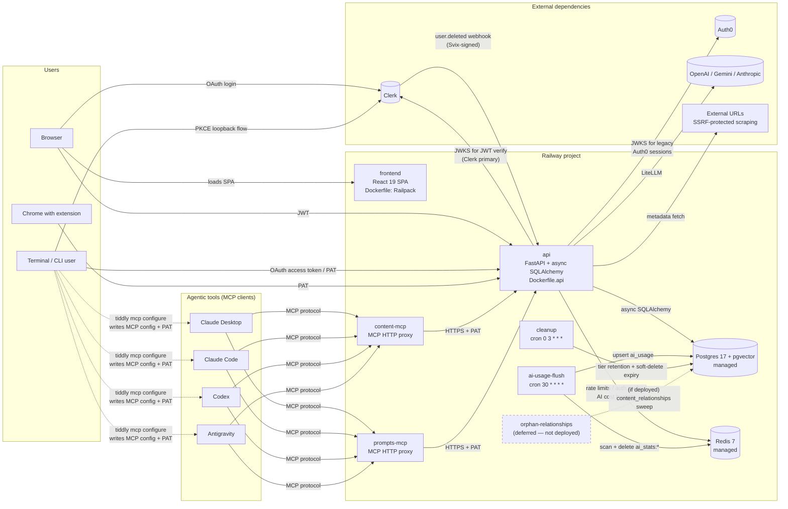

# Tiddly — Architecture

Start here for a system-level overview. Topic-specific deep dives live alongside this file in `docs/` and are linked inline. For conventions and coding rules, see `AGENTS.md`. For deployment specifics, see `README_DEPLOY.md`.

Tiddly is a multi-tenant SaaS for managing bookmarks, notes, and prompt templates, with AI-assisted metadata and first-class MCP integration for agentic tools. It is deployed as a small fleet of Railway services backed by managed Postgres and Redis.

---

## 1. System diagram

**Notes on the diagram:**

- The api service is the only process with direct database access. MCP servers and the CLI are clients of the api, not independent DB consumers.
- Redis fails open: if it's unavailable, rate limiting and auth caching degrade but the app still serves requests.
- `orphan-relationships` is implemented and documented in `README_DEPLOY.md`, but **intentionally not deployed** at current beta scale. See [KAN-67](https://tiddly.atlassian.net/browse/KAN-67) for the deferral rationale and §9 below.
- Dashed edges from CLI to the agentic tools represent `tiddly mcp configure` — a one-time local setup action where the CLI mints a PAT (via the api) and writes it into each detected tool's native config file (`claude_desktop_config.json`, `~/.claude.json`, `~/.codex/config.toml`, `~/.gemini/config/mcp_config.json`). These are not runtime network protocols; they're filesystem writes on the user's machine that bootstrap the subsequent MCP-protocol edges.

---

## 2. Components

### Frontend — `frontend/`

- React 19.2 + Vite 7 + Tailwind CSS 4.1 + TypeScript 5.9, Node v22
- State: Zustand stores in `stores/` (per-domain: filters, settings, tags, tokens, consent, ai)
- Data fetching: TanStack React Query v5 with a shared `queryClient`; hooks grouped by domain (`useBookmarksQuery`, `useBookmarkMutations`, ...)
- Routing: React Router v7 with `createBrowserRouter`; top-level regions include the content views (`/bookmarks`, `/notes`, `/prompts`), settings, docs hub, and public marketing pages
- Editor: Milkdown (markdown) for notes/descriptions; CodeMirror with Nunjucks highlighting for prompt templates
- Auth: `@clerk/clerk-react` (modal sign-in/sign-up; ~60s session tokens auto-refreshed by clerk-js — no client-held refresh token); axios interceptor fetches `getToken()` per request, retries a 401 once with `skipCache: true`, then parks the request in the session-expiry store for in-place re-auth (never logout/navigation on expiry — teardown happens only on deliberate logout). The auth-provider SDK is lint-restricted to `AuthProvider.tsx` plus the two prebuilt-UI mounts (`SessionExpiredDialog`, `SettingsAccount`).
- Error handling: axios response interceptor centralizes 401 (re-auth), 402 (quota), 429 (rate limit), 451 (consent required)
- Every request sends `X-Request-Source: web` for server-side audit/source detection

### API — `backend/src/`

- FastAPI with async SQLAlchemy 2.0 on Postgres 17 (pgvector), Python 3.13, dependencies managed by `uv`
- Entry point: `api/main.py`. Routers in `api/routers/`, services in `services/`, models in `models/`, schemas in `schemas/`
- PYTHONPATH is `backend/src`; imports are always relative to that root (never `from backend.src...`)
- Detailed breakdown of routers, services, auth, rate limiting, and LLM integration is in §4–§8 below

### MCP servers — `backend/src/mcp_server/` and `backend/src/prompt_mcp_server/`

Two independent MCP services that agentic tools (Claude Desktop, Claude Code, Codex, Antigravity) talk to via the MCP protocol. Both proxy through the api service over HTTPS using a bearer token; they hold no database credentials and — by design — **never verify the token themselves** (the backend API is the only verifier, AD10).

- **content-mcp** — bookmarks + notes: search, get, create, update, content-level edits (old_str/new_str patches), tag and filter listing, relationship creation. Local dev port: 8001.
- **prompts-mcp** — prompt templates: search, metadata/content fetch, create, update, content-level edits, tag/filter listing. Local dev port: 8002.

Both deliberately **do not expose delete**. Destructive operations are web-UI-only. Both are deployed as regular Railway services with public domains.

**OAuth for AI connectors (M5).** Both servers speak the server side of the MCP authorization spec so OAuth-only clients (ChatGPT, Claude Desktop/web native connectors) can connect with a paste-the-URL flow, while existing bearer/PAT configs keep working unchanged. The shared implementation is `backend/src/shared/mcp_oauth.py`; the servers are assembled differently (the content server serves FastMCP's `http_app()` via `mcp_server/app.py` under uvicorn; the prompt server hand-builds a Starlette app in `prompt_mcp_server/main.py`), but expose the same surface:
- **Protected-resource metadata** (RFC 9728) at `/.well-known/oauth-protected-resource[/mcp]`, advertising the server's own `/mcp` endpoint as the `resource` and Clerk (`https://<CLERK_FRONTEND_API>`) as the authorization server. Public, CORS-enabled.
- **A presence-only 401 gate** on `/mcp`: no `Authorization` header → `401` + `WWW-Authenticate` discovery pointer before dispatch. A present bearer (valid or not) passes through to the backend (AD10 holds).
- **DNS-rebinding Host/Origin protection** on the `/mcp` transport (SDK `TransportSecuritySettings`): `allowed_hosts` derived from the validated resource URL; the browser-`Origin` allowlist (`MCP_ALLOWED_ORIGINS`) fails closed. Injected natively on the prompt server and via a shared `TransportSecurityGate` ASGI middleware on the content server (FastMCP's `http_app()` does not expose the setting).
- **Config validated at startup** (crashes on boot if a service's `*_MCP_RESOURCE_URL` or `CLERK_FRONTEND_API` is missing/malformed) — see `README_DEPLOY.md` for the required per-service env vars and pre-deploy staging.

Clerk **dynamic client registration** (each connecting client registers itself) is enabled at the identity provider, not implemented here. The step-by-step per-client connection docs (Settings → AI Integration, ChatGPT/Claude/Codex) are written after the connector verification ladder confirms the flows.

### CLI — `cli/` (Go + Cobra + Viper)

A thin REST client plus an MCP-setup assistant.

- Commands: `login`, `logout`, `auth`, `status`, `mcp configure|status|remove`, `skills configure|list`, `export`, `tokens`, `config`, `update`, `ai-instructions` (zero-auth; fetches the hosted `llms-cli-instructions.txt` and prints it — the command an agent should call first)
- Auth: browser-based OAuth login (authorization code + PKCE with a loopback listener on `127.0.0.1`, against the Clerk instance; `TIDDLY_OAUTH_*` env overrides point it at non-prod) or `--token bm_...` for non-interactive/headless use; credentials stored via `go-keyring` with a plaintext fallback at `~/.config/tiddly/credentials`. Refresh tokens rotate — the CLI stores every returned pair.
- Config: `~/.config/tiddly/config.yaml` (Viper-managed), `TIDDLY_*` env overrides
- **Primary non-obvious value:** `tiddly mcp configure` detects installed agentic tools on the host (by probing PATH and tool-specific config locations), generates scoped PATs, and writes the MCP server URLs into each tool's native config file (e.g. `claude_desktop_config.json`, `~/.claude.json`, `~/.codex/config.toml`, `~/.gemini/config/mcp_config.json`). This is the "connect my Claude apps to Tiddly" onramp.
- Sends `X-Request-Source: cli` on every request

### Chrome extension — `chrome-extension/`

Manifest V3. Vanilla JS, no build step.

- Popup UI has two modes: **save** (on regular pages — URL, title, description, tag autocomplete, save to `/bookmarks/`) and **search** (on restricted pages like `chrome://*` — query + tag filters)
- Background service worker relays API calls; options page manages the PAT
- PAT stored in `chrome.storage.local`; on every request sets `Authorization: Bearer <token>` and `X-Request-Source: chrome-extension`
- Hardcoded `API_URL = https://api.tiddly.me` in `background-core.js`; 15s timeout via AbortController

### Background jobs — `backend/src/tasks/`

| Script | Deployed? | Schedule | Responsibility |
|---|---|---|---|
| `ai_usage_flush.py` | Yes | `30 * * * *` | Scan Redis `ai_stats:*` hashes for *past* hours, upsert aggregated rows into `ai_usage`, delete processed keys. Excludes the current hour to preserve in-flight writes. Upsert uses SET (not INCREMENT) so re-runs are idempotent. |
| `cleanup.py` | Yes | `0 3 * * *` | Tier-based `content_history` retention, permanent deletion of soft-deleted entities older than 30 days (with their history, via app-level cascade), and orphaned-history sweep. |
| `orphan_relationships.py` | **Deferred** | — | Detect (and optionally delete) rows in `content_relationships` whose polymorphic source/target entity no longer exists. Documented in README_DEPLOY.md for future deploy but not running today. See [KAN-67](https://tiddly.atlassian.net/browse/KAN-67). |

Each cron runs as its own Railway service with its own schedule and failure mode. None shares a pipeline or depends on another.

**Cron schedules are set in Railway's per-service Deploy settings, not in the Python task files.** Grepping the repo for `30 * * * *` or similar will come up empty — the schedule lives in the deployed service config. This is by design (keeps task code decoupled from when/how it's invoked), but worth knowing before you go hunting.

### External dependencies

- **Auth0** — legacy JWT verifier only, during the dual-accept window (RS256, custom email claim namespace `https://tiddly.me`): web login moved to Clerk at the M6a cutover (2026-07-15), so Auth0 now exists solely so the backend can honor lingering Auth0 sessions (chiefly the iOS app) until M6b decommissions it.
- **Clerk** — the primary IdP as of the M6a cutover (2026-07-15): web login, CLI OAuth (M4), and MCP OAuth connectors (M5) all authenticate against Clerk; the backend dual-accepts Auth0 tokens by issuer until M6b (see §5). Also the one inbound provider-calls-us surface: Clerk delivers `user.deleted` webhooks (Svix-signed) to `POST /webhooks/clerk` for account deletion (see §5).
- **OpenAI / Google Gemini / Anthropic** — LLM providers accessed via LiteLLM. Only `OPENAI_API_KEY` is required today (platform default for suggestions is `openai/gpt-5.4-nano`). Gemini/Anthropic keys are optional until more AI use cases ship.
- **External URLs** — the api scrapes target URLs for bookmark metadata (`services/url_scraper.py`), wrapped in SSRF protection (see §10).

---

## 3. Request flow — example: create a bookmark with AI tag suggestions

A realistic happy-path walkthrough touching most of the moving parts:

1. **Browser → Frontend.** React SPA loads. A Clerk session supplies a short-lived JWT (auto-refreshed by clerk-js).
2. **Browser → api: `POST /bookmarks/`** with bearer JWT and `X-Request-Source: web`.
3. **Auth layer** (`core/auth.py`): routes the JWT by issuer and verifies its signature against that issuer's cached JWKS (1-hour TTL), resolves the token `sub` → user via the Redis auth cache (5-min TTL) with DB fallback, attaches a `RequestContext` to `request.state` for audit, checks that the user has accepted current policy versions (else HTTP 451).
4. **Rate limiter** (`core/rate_limiter.py`): looks up the user's tier → `WRITE` limits; consults Redis sliding-window + daily Lua script; rejects with 429 + `Retry-After` if over. Redis-backed; fails open on Redis outage.
5. **BookmarkService.create**: validates URL uniqueness (partial unique index on `(user_id, url)` for non-deleted rows), enforces tier quota + field-length limits, inserts the row with a UUIDv7 PK. A DB trigger updates the `search_vector` tsvector for FTS.
6. **Optional: URL scrape.** If the client requested metadata fetch, `services/url_scraper.py` validates the target (`validate_url_not_private()` blocks RFC1918, loopback, link-local; resolves hostnames to prevent DNS rebinding) and fetches title/description.
7. **Response.** Body serialized; `ETagMiddleware` generates a weak ETag; `RateLimitHeadersMiddleware` emits `X-RateLimit-*` headers from `request.state.rate_limit_info`.
8. **Follow-up: AI tag suggestions.** Browser calls `POST /ai/suggest-tags`. Auth flow repeats (this time the AI-specific rate limit bucket — `AI_PLATFORM` or `AI_BYOK` depending on whether an `X-LLM-Api-Key` header is present).
9. **LLMService** resolves the config (`AIUseCase.SUGGESTIONS` → `openai/gpt-5.4-nano` + platform key, or user-model + user-key for BYOK). Calls LiteLLM's `acompletion()`. On success, records cost + count into Redis via `HINCRBY` + `HINCRBYFLOAT` on key `ai_stats:{user_id}:{hour}:{use_case}:{model}:{key_source}` with a ~7-day TTL. Never logs prompts, completions, or API keys.
10. **Hourly flush.** At the next `:30`, the `ai-usage-flush` cron scans Redis, aggregates completed hours, and upserts into `ai_usage`. The `ai_usage_analytics` view (SHA-256-pseudonymized `user_hash`) makes these rows safe to expose to a scoped read-only analytics role.

---

## 4. Data model — entities and key patterns

### Core entities (`models/`)

All inherit `UUIDv7Mixin` (time-sortable PK), `TimestampMixin` (`created_at`, `updated_at` server-side), and most inherit `ArchivableMixin` (`deleted_at`, `archived_at`).

| Model | Notes |
|---|---|
| `User` | Provider identity (`auth0_id` and/or `external_auth_id` — at least one, enforced by CHECK; see §5) + email + `tier`. One-to-many cascade to bookmarks, notes, prompts, api_tokens. |
| `Bookmark` | URL + title/description/summary/content. Trigger-maintained `search_vector`. Partial unique index on `(user_id, url)` for non-deleted rows. |
| `Note` | Title + markdown content/description. Trigger-maintained `search_vector`. |
| `Prompt` | Jinja2 template `name` + title/description/content + JSONB `arguments`. Trigger-maintained `search_vector`. Partial unique index on `(user_id, name)` for active prompts. |
| `Tag` | User-scoped; many-to-many via `bookmark_tags`, `note_tags`, `prompt_tags` junctions. |
| `ContentHistory` | Unified versioning for all three entity types (polymorphic `entity_type` + `entity_id`). Reverse diffs via diff-match-patch; snapshots every 10th version; JSONB `metadata_snapshot`. Audit events (delete/undelete/archive/unarchive) have `version=NULL`. |
| `ContentRelationship` | Polymorphic, bidirectional canonical ordering. `source_id` and `target_id` are plain UUIDs — **no FK constraint** (see below). |
| `AiUsage` | Hourly buckets `(bucket_start, user_id, use_case, model, key_source)` with `request_count` + `total_cost`. Unique constraint on all five. |
| `ApiToken` | PAT with `bm_` prefix; stored as SHA-256 hash + 12-char plaintext prefix for display/audit. |
| `UserConsent`, `UserSettings`, `ContentFilter`, `FilterGroup` | Supporting models for policy tracking, preferences, saved views. |

### Cross-cutting data patterns

- **Multi-tenant scoping is application-level, not RLS-enforced.** Every query in every service filters by `user_id`. There is no Postgres row-level security — the invariant is maintained by the service layer. This is the single most important architectural invariant to preserve.
- **Soft delete everywhere.** Rows are removed from list/search results via `deleted_at`. A nightly cron (`cleanup`) eventually hard-deletes rows older than 30 days along with their history records.
- **Archiving is separate from soft delete.** `archived_at` is a user-facing "hide from default views" state; items remain queryable. Both mixin columns are indexed.
- **Time-sortable UUIDv7** primary keys throughout. Allows natural chronological ordering without a separate `created_at` index in most queries.
- **Trigger-maintained FTS vectors.** Bookmarks/Notes/Prompts each have a `search_vector` TSVECTOR column that a Postgres trigger keeps up to date on insert/update (weighted: title/name=A, description/summary=B, content=C). GIN indexed. Migration: `c07d5e217ca3_add_search_vector_columns_triggers_gin_*`.
- **pgvector** is enabled on the Postgres cluster, reserved for future embedding-based features.
- **Public sharing columns.** Bookmarks/notes/prompts each carry `is_public` (bool) and a nullable `public_token` (random `secrets.token_urlsafe(32)`, stored **plaintext** — an unguessable URL component, not a credential, so unlike PATs it is *not* hashed). A partial unique index on `public_token WHERE public_token IS NOT NULL` enforces per-table token uniqueness while allowing unlimited unshared rows. **`is_public`, not token presence, is the source of truth for "shared"** — the token is retained on unpublish so re-publishing restores the same URL. A nullable `shared_at` (migration `77ccf8214c82`) is stamped on each publish (and left on unpublish) to power the owner's "Shared content" view; writing it does not bump `updated_at`. Migration for the original columns: `5fd6c03a4e43_add_public_sharing_fields_to_content_`. The public read/clone/share surface is described in §5; the owner's shared-content list uses `GET /content/?is_public=true`.

### Concurrency control for content edits

Two concurrency models coexist for content writes, chosen per operation semantics:

- **Optimistic locking (`expected_updated_at` → 409).** Used by the *declarative* PATCH endpoints (`PATCH /bookmarks/{id}`, `/notes/{id}`, `/prompts/{id}`, `/prompts/name/{name}`) where the client submits a full new state. The handler compares the client-supplied `expected_updated_at` against the current row; mismatch returns 409 with the current server state. Clients are expected to refetch and merge.
- **Server-side row locking (`SELECT ... FOR UPDATE`).** Used by the *content-addressable* `str-replace` endpoints (`PATCH /<entity>/{id}/str-replace` for bookmarks/notes/prompts, plus `PATCH /prompts/name/{name}/str-replace`). The handler acquires a row lock via `BaseEntityService.get_for_update(...)` (or `PromptService.get_by_name_for_update(...)` for the by-name route) before reading-and-rewriting content. Parallel calls against the same entity serialize at the database; each acquires the lock in turn, reads the current content, applies its `old_str → new_str` against fresh state, and commits. All succeed (or, if a competing edit removed the pattern they were targeting, surface the existing `400 no_match` — never a silent overwrite). No client-side timestamp tracking, no 409-retry round-trips.

The lock is released when the FastAPI request transaction commits or rolls back (see `db/session.py`). Postgres row locks survive `SAVEPOINT` rollback, so the savepoint-retry loop in `history_service.record_action` does not release a lock acquired by `get_for_update` in the same transaction.

If FK-insert contention against locked rows ever becomes measurable, Postgres's `FOR NO KEY UPDATE` (less restrictive than `FOR UPDATE`) is a future tuning option; not justified at current scale.

### Versioning — `content_history`

Single table covering all three entity types. Every content change produces a `ContentHistory` row: a reverse diff (diff-match-patch delta from new → old) plus a JSONB `metadata_snapshot`. Every 10th version stores a full snapshot instead of a diff so reconstruction cost is bounded. Audit-only events (delete, restore, archive, unarchive) are stored with `version=NULL`. Retention is tier-based (see §11).

Deeper treatment: [`docs/content-versioning.md`](content-versioning.md).

### Polymorphic relationships — `content_relationships`

Designed to link any entity type to any other. Because `source_type`/`target_type` can point to three different tables, a traditional `FOREIGN KEY ... ON DELETE CASCADE` is impossible. Cleanup is done in application code inside `BaseEntityService.delete()`, which calls `relationship_service.delete_relationships_for_content(...)` in the same transaction as the entity delete.

There is a real `ON DELETE CASCADE` FK on `content_relationships.user_id` → `users.id`, so user deletion *does* cascade.

Relationships are bidirectional with canonical ordering (no duplicate "A → B" and "B → A" rows). A unique constraint on `(user_id, source_type, source_id, target_type, target_id, relationship_type)` enforces this.

---

## 5. Authentication, consent, and request identity

**Two authentication mechanisms** converge in `core/auth.py`:

1. **IdP-issued JWTs (dual-accept — Auth0 → Clerk migration window).** The token's `iss` claim is read *unverified for dispatch only* and routes to the matching verifier; the selected verifier then enforces signature (RS256 against that issuer's cached JWKS, 1-hour TTL), issuer, expiry, and per-issuer claims from scratch. Both paths resolve to the same `users` rows:
   - **Auth0**: verifies audience + issuer; `auth0_id` (= `sub`), `email`, `email_verified` read with custom email claims under the `AUTH0_CUSTOM_CLAIM_NAMESPACE` prefix (Auth0 Post-Login Action — see README_DEPLOY.md Step 6d). Looks up/creates users by `users.auth0_id`. Every Auth0-path authentication logs `auth0_path_authentication source=<client>` — the cutover signal watched during M6a→M6b. **Removed at decommission (M6b).**
   - **Clerk**: one verifier, two token kinds, discriminated by the signature-covered JWT header `typ` (see `decode_clerk_jwt`). *Session tokens* (`typ: JWT`, ~60s lifetime): no audience claim exists; the equivalent check is `azp` (authorized party) against `CLERK_AUTHORIZED_PARTIES` — present → must match, absent → tolerated (non-browser tokens carry none); plain `email`/`email_verified` claims (instance session-token customization). *OAuth access tokens* (`typ: at+jwt` per RFC 9068, 24h lifetime — the CLI's tokens, and MCP's later): same issuer and JWKS; `client_id` must be present (logged, deliberately not allowlisted — rationale in code); no email claims (null-email-tolerant resolution). The azp rule applies to both kinds. Verified with an explicit 5s clock-skew leeway. Both kinds look up/create users by `users.external_auth_id` (= `sub`).
   - **Per-issuer JIT-create flags** (`CLERK_JIT_CREATE_ENABLED`, default off; `AUTH0_JIT_CREATE_ENABLED`, default on): lookup always works; *creation* of a first-seen identity is gated per issuer. A denied create is a generic 401 plus a warning log naming the identity — the backend-enforced version of the migration window rules (no pre-import Clerk accounts, no post-flip Auth0 accounts). Removed in M6b.
   - **Anti-resurrection tombstones** (M8): before any JIT create, the identity is checked against `deleted_identities` — a still-valid token for a deleted account (a not-yet-expired Clerk JWT, or an Auth0 session kept alive by refresh tokens on iOS) must not re-create an empty user row. A tombstoned identity gets an explicit `401` carrying `error_code: "account_deleted"` (with a human-readable `detail: "This account was deleted"`) — a recorded exception to the generic-401 policy: only a holder of a validly-signed token for that identity can see it. Clients bind to the stable `error_code`, not the prose, to show a terminal state instead of a re-auth loop. Tombstones block dead credentials, not people — providers never reuse `sub` values, so a returning user signs up as a brand-new identity.
   - A non-PAT bearer that isn't parseable as a JWT at all → generic 401 plus a warning log naming the cause (the observable symptom of an OAuth app misconfigured to issue opaque tokens).
2. **Personal Access Tokens (PAT)** for CLI, MCP servers, Chrome extension, and scripts. Format: `bm_<random>`. Validated by `TokenService` against `api_tokens.token_hash` (SHA-256). A 12-char plaintext `token_prefix` is stored for UI display and audit. Untouched by the migration (AD1).

**Request identity resolution** (per request):

1. Parse `Authorization: Bearer <token>`.
2. If prefixed `bm_`, route to PAT validation. Otherwise dispatch by the JWT's issuer (above); unknown or missing issuer → 401.
3. Resolve to a `User` row via the Redis auth cache (5-min TTL; segment per identifier — see §8), falling back to DB and repopulating cache.
4. Attach a `RequestContext(source, auth_type, token_prefix)` to `request.state` for downstream audit logging. `auth_type` is `session` for any IdP JWT (provider-neutral; historical `content_history` rows persisted the pre-rename value `auth0` and are never backfilled), `pat`, or `dev`.
5. Enforce **consent**: authenticated routes (except the consent endpoints themselves and `/health`) check that the user has accepted current privacy-policy and terms versions. Mismatch returns HTTP 451 with instructions; the frontend opens a consent dialog. Skipped in `DEV_MODE`. The consent-accept flow invalidates **every** cache segment the user can be cached under (`id`, `auth0`, `ext`).
6. Apply the matching **rate limit** bucket (see §6).

**Identity columns during the window**: `users.auth0_id` and `users.external_auth_id` are both nullable-unique; the DB CHECK constraint `ck_user_has_identity` guarantees at least one is present. M6b drops `auth0_id` + the constraint and makes `external_auth_id` NOT NULL.

**DEV_MODE bypass**: set `VITE_DEV_MODE=true` locally. Creates a synthetic user (`auth0_id="dev|local-development-user"`) without any auth header and is exempt from the JIT-create gates. Settings validation refuses to let DEV_MODE coexist with a non-local database as a safety guard.

**Auth variants exported from `core/auth.py`:**

- `get_current_user` — full flow: auth + rate limit + consent
- `get_current_user_without_consent` — for the consent-accept endpoint itself
- `get_current_user_session_only` — rejects PATs (403). Used where an interactive session is semantically required.
- `get_current_user_session_only_without_consent` — session-only AND skips the consent gate. Used on the consent-accept endpoint when PATs must also be rejected (a user accepting the policy cannot do so via a CLI token).
- `get_current_user_ai` — session-only, no *global* rate limit. AI endpoints apply a separate `AI_PLATFORM`/`AI_BYOK` bucket.

### Inbound webhooks (Clerk → backend)

`POST /webhooks/clerk` (`api/routers/webhooks.py`) is the first **inbound provider-calls-us** surface: Clerk (via Svix) delivers events to it. Currently subscribed to `user.deleted` only — the account-deletion sync (a Clerk-side deletion removes the identity; this handler removes the data). Design rules, in order of importance:

- **Signature verification is unbypassable.** The Svix signature (`svix-id`/`svix-timestamp`/`svix-signature` headers, HMAC over the raw body) is verified before the body is parsed; there is deliberately no Pydantic body model on the route, and the raw-body read itself is bounded (256 KB → 413) since this is the app's one unauthenticated body-reading route. A signed-but-malformed body (invalid JSON, non-object event/data) is a classified 400 — note that Svix treats *any* non-2xx as a failed attempt, so a 4xx does not suppress retries; it just makes the failure legible. No secret configured (`CLERK_WEBHOOK_SIGNING_SECRET`, per environment) → the endpoint **fails closed** with 503.
- **Delivery is finite, not queued-forever.** Svix makes 8 attempts over ~28 hours (immediate, 5s, 5m, 30m, 2h, 5h, 10h, 10h; a 2xx must arrive within 15s), then marks the message Failed — after which **nothing deletes the user's Tiddly data until an operator replays the delivery** (this webhook is the only post-Clerk-deletion trigger). An exhausted `user.deleted` delivery is a privacy-affecting incident, not routine; detection + replay runbook in README_DEPLOY Step 6f. Svix fires a `message.attempt.exhausted` operational webhook on exhaustion — the ready-made trigger if automated alerting is ever built.
- **Idempotent by construction.** Svix delivery is at-least-once; a replayed deletion tombstones ON CONFLICT DO NOTHING and reports success.
- **Deletion order** (`services/user_service.delete_user_by_external_auth_id`): acquire the identity advisory lock(s) → tombstone every identity the row carries (both `external_auth_id` and `auth0_id` for imported users) → delete the row (DB cascades do the heavy lifting — see the passive_deletes notes on `models/user.py`); then the *route* commits and only then invalidates every auth-cache segment (invalidate-before-commit lets a concurrent request repopulate the cache from the still-visible row — review-round finding; the consent router established commit-then-invalidate). Unknown identities are tombstoned and acknowledged.
- **Concurrency**: identity lifecycle transitions are serialized by transaction-scoped advisory locks (`user_service.acquire_identity_lock`, keys `clerk:`/`auth0:`) taken by deletion and by JIT creation only — cache hits and plain lookups never lock. The residual deletion-vs-cache-miss ordering is closed lock-free by a post-population tombstone recheck in `get_or_create_user` (see the §16 invariant). These guarantees assume Redis operations succeed; the Redis client fails open, so the webhook turns a failed post-commit invalidation into a 503 (Svix retries; the idempotent replay re-invalidates), and the recheck's own eviction failure is a logged, TTL-bounded residual — a *full* Redis outage degrades safe (cache reads fail too → DB path → tombstone 401); only a partial failure in that exact window can leave one stale entry for up to one TTL. Deterministic interleaving tests: `tests/services/test_user_deletion_concurrency.py`.
- **Webhooks are sync convenience, never source of truth**: JIT provisioning remains the only creation path; this endpoint only deletes (and is the natural home for future billing/org events — the handler no-ops other event types defensively).
- **Tombstone retention**: no sweep during the dual-accept window (Auth0-side tombstones must survive until M6b removes the Auth0 path). The sweep lands in M6b inside the existing daily cleanup task.

### Public sharing surface (unauthenticated)

A separate router (`api/routers/public.py`, prefix `/public`) serves shared content with **no auth dependency**:

- `GET /public/{bookmarks|notes|prompts}/{token}` — looks the item up by `public_token` (plain equality) and returns a **locked-down public schema**: content, title/description, dates, and a derived `is_archived` flag — never tags, relationships, owner identity, raw `archived_at`, or the internal id (the token is the public identifier). 404 for unknown/unpublished/**soft-deleted** items; archived items return 200 with `is_archived: true`.
- `POST /public/{type}/{token}/save` — **auth-required** (`get_current_user`): clones the shared item into the caller's account via the normal service `create()` path, so quota, tier field-limits, and uniqueness all apply. It shares the `/public` prefix but, being a `POST`, is skipped by `ETagMiddleware`.

Owner-side **share management** lives on the type routers (auth + owner-scoped, fetched by `user_id`): `POST`/`DELETE /{type}/{id}/share` (publish/unpublish) and `POST /{type}/{id}/rotate-share-token`. These write **only** the sharing columns — they never bump `updated_at` or record `ContentHistory` (the column has no `onupdate`, so not assigning it preserves it; this is what keeps a mid-edit publish from reverting an unsaved draft on the client). `public_token` is exposed only on the single-item detail response, never on list/search responses — keeping it off bulk surfaces. (The content MCP's `get_item` proxies an item's detail, so the token can surface there to the owner's own agent; `search_items`/list summaries never include it.)

Because public requests have no user, abuse is bounded by an **IP-keyed** rate limit (§6), and the real client IP is resolved via `core/request_utils.py` (`X-Real-IP` first, then `X-Forwarded-For` first entry, then the socket) rather than `request.client.host` — see the drift caveat in §17.

---

## 6. Rate limiting

Implemented in `core/rate_limiter.py` + `core/rate_limit_config.py`.

**OperationType buckets** (distinct Redis keys, distinct limits):

| Bucket | Covers |
|---|---|
| `READ` | List, search, get |
| `WRITE` | Create, update, delete |
| `SENSITIVE` | PAT management, account settings |
| `AI_PLATFORM` | AI endpoints using platform API keys |
| `AI_BYOK` | AI endpoints using a user-supplied `X-LLM-Api-Key` (counted separately from platform) |

Each bucket has both a **per-minute** sliding window (Redis sorted set of timestamps) and a **per-day** fixed window (incremented via Lua script). Limits are tier-scoped. Tiers with `0/0` limits for a bucket (FREE and STANDARD both have `0/0` for `AI_PLATFORM` and `AI_BYOK`, today) short-circuit without even hitting Redis — only PRO has non-zero AI limits.

`GET /ai/health` exposes remaining quota in **both** windows — `remaining_per_minute` / `limit_per_minute` alongside `remaining_per_day` / `limit_per_day` — plus `resets_at`, the absolute UTC timestamp when the daily counter expires (derived from the key's Redis TTL; `null` when no counter exists yet). Clients can show either an absolute time or a derived countdown; absolute is immune to staleness from cached queries. A dedicated `AIRateLimitStatus` dataclass in `core/rate_limiter.py` wraps the three values; the minute window is peeked non-destructively via `ZCOUNT` (exclusive lower bound to mirror the writer's `ZREMRANGEBYSCORE` semantics), and the TTL read goes through a dedicated `RedisClient.ttl()` wrapper that normalizes Redis's `-2`/`-1`/positive sentinels into `int | None`. The entire peek is fail-open: any Redis failure resolves to "full quota remaining" (and `resets_at: null`) to avoid false 429s on the status endpoint. The daily counter uses a per-user fixed window: Redis `INCR` with an 86400-second `EXPIRE` set only on the first increment, so each user's window starts at their first request after the previous key expired — not a shared UTC-midnight reset.

Results are stored in `request.state.rate_limit_info` and serialized to `X-RateLimit-Limit`, `X-RateLimit-Remaining`, `X-RateLimit-Reset`, and (when exceeded) `Retry-After` response headers.

**IP-based limiting for public endpoints.** The unauthenticated `/public/*` reads have no user to key on, so `check_ip_rate_limit(ip)` applies a per-IP sliding-window + daily cap (keys `rate:ip:{ip}:public:min` / `:daily`; limits in `rate_limit_config.py`). The per-minute cap is the binding constraint: public responses use `max-age=0, must-revalidate`, so every view — including 304 revalidations — runs the route and consumes a token. The 256-bit token already defeats enumeration, so this is DoS/abuse mitigation, not enumeration defense. Same fail-open semantics as below.

**Fail-open semantics**: if Redis is unreachable, the limiter logs a warning and allows the request rather than hard-failing. This is intentional — Redis downtime should degrade, not break, the API. It also means rate limits are effectively **per-instance** when Redis is absent; multi-instance deployments without Redis would allow per-instance quota. Currently the deployed topology is a single API instance, so this is a non-issue, but worth knowing before horizontally scaling.

---

## 7. LLM integration

Implemented in `services/llm_service.py` using LiteLLM.

### Use cases and defaults

| `AIUseCase` | Default model | Status |
|---|---|---|
| `SUGGESTIONS` | `openai/gpt-5.4-nano` | **Wired up**: suggest-tags, suggest-metadata, suggest-relationships, suggest-prompt-arguments, suggest-prompt-argument-fields |
| `TRANSFORM` | `gemini/gemini-flash-lite-latest` | Defined, not yet wired to an endpoint |
| `AUTO_COMPLETE` | `gemini/gemini-flash-lite-latest` | Defined, not yet wired |
| `CHAT` | `openai/gpt-5.4-mini` | Defined, not yet wired |

Defaults are overridable per-use-case via `LLM_MODEL_*` env vars. The current `/ai/models` endpoint returns 7 GA models (OpenAI nano/mini/flagship, Anthropic Haiku/Sonnet/Opus, Gemini Flash Lite). Gemini Flash and Gemini Pro are defined but commented out due to chronic provider 503s — see `evals/LEARNINGS.md`.

### Platform vs BYOK

`LLMService.resolve_config(use_case, user_api_key, user_model)`:

- If `user_api_key` is supplied (BYOK), the request uses the user's key, and the user may also pass their own `user_model` (validated against `_SUPPORTED_MODEL_IDS`).
- If no user key, the server uses its own platform key for the use case. **In platform mode, the user's requested `user_model` is ignored** — platform callers are locked to the use-case default. This is deliberate: it keeps platform cost deterministic and prevents arbitrary-model abuse.

### Cost tracking

Each successful completion:

1. Computes cost via LiteLLM's `completion_cost(completion_response=...)` (public API — never touch `_hidden_params`, which is private and unstable across versions).
2. Writes a Redis hash keyed `ai_stats:{user_id}:{hour}:{use_case}:{model}:{key_source}` with fields `count` (`HINCRBY`) and `cost` (`HINCRBYFLOAT`). TTL ~7 days as a safety net.
3. Emits a structured info log with metadata (user_id, use_case, model, key_source, cost, latency). **Never** logs prompts, completions, or API keys.

The `ai-usage-flush` cron aggregates these buckets into the `ai_usage` table every hour, processing only *past* hours so it never loses in-flight writes. The `ai_usage_analytics` Postgres view adds a SHA-256 `user_hash` pseudonymization layer for analytics tools; a read-only `analytics_reader` role grants SELECT on the view only.

### Spend protection

There is no application-level circuit breaker. Cost containment relies on **provider-side monthly spend caps** configured in each provider dashboard (OpenAI billing, Google AI Studio, Anthropic console). Required for every provider whose platform key is set on the api service. See [README_DEPLOY.md Step 8a](../README_DEPLOY.md#8a-provider-spend-caps-required).

### Errors

LiteLLM exceptions propagate; a shared exception handler registered on the AI router maps them to typed HTTP responses (`llm_auth_failed` → 422, `llm_rate_limited` → 429, `llm_timeout` → 504, `llm_bad_request` → 400, `llm_connection_error` → 502, `llm_parse_failed` → 502, other → 503). All use the `llm_*` prefix so the frontend can distinguish provider failures from platform auth failures. `llm_parse_failed` is raised by `services/suggestion_service.py::LLMParseFailedError` when the provider returns a response that doesn't match the expected structured-output schema — clients should retry, ideally with a different model.

Deeper treatment: [`docs/ai-integration.md`](ai-integration.md).

---

## 8. Redis responsibilities

One Redis instance, three independent uses. All fail-open.

| Purpose | Keys | Notes |
|---|---|---|
| **Rate limiting** | Per-user sliding-window sorted sets + daily counters | Enforced via Lua for daily atomic increment. Fail-open logs a warning and permits the request. |
| **Public IP rate limiting** | `rate:ip:{ip}:public:min` (sorted set) + `rate:ip:{ip}:public:daily` (counter) | Per-IP cap for unauthenticated `/public/*` reads (§6). Fail-open. |
| **Auth cache** | User cached per identifier segment: `id:{user_id}`, `ext:{external_auth_id}`, and transitional `auth0:{auth0_id}` (removed M6b); keys carry a schema version (`auth:v6:...`) | 5-minute TTL. Invalidated on email/consent-version change (every segment); falls through to Postgres. |
| **AI cost buckets** | `ai_stats:{user_id}:{hour}:{use_case}:{model}:{key_source}` hashes | Written by `LLMService` after each call; flushed to `ai_usage` hourly by cron. ~7-day TTL. |

**What gets lost if Redis restarts:** current-minute rate-limit quotas reset (users briefly un-throttled), auth cache cold-starts (slightly slower requests for 5 minutes), and any AI cost bucket written since the last successful flush. None of these are catastrophic; they're operational annoyances, not data-correctness events.

---

## 9. Background jobs (operational)

Summary of the three cron services — full deployment details in README_DEPLOY.md.

### `ai-usage-flush` (every hour at `:30`)

- Scans Redis for `ai_stats:*` keys
- Filters to hours strictly earlier than the current hour (never processes in-flight buckets)
- Upserts aggregated rows into `ai_usage` via `ON CONFLICT DO UPDATE SET` (SET, not INCREMENT — safe to re-run the same bucket)
- Deletes processed Redis keys
- Log outcomes: `no keys found`, `no completed hourly buckets to flush`, or `complete` with `keys_processed` and `total_cost_flushed`

### `cleanup` (daily at `03:00 UTC`)

Three responsibilities in one cron run:

1. Permanently delete soft-deleted entities (bookmarks/notes/prompts) whose `deleted_at > 30 days`. Deletes their `ContentHistory` rows first (application-level cascade, no FK).
2. Prune `ContentHistory` older than the user's tier retention (FREE: 1 day, STANDARD: 5 days, PRO: 15 days — see §11).
3. Sweep orphaned `ContentHistory` rows where the referenced entity no longer exists (defense-in-depth).

### `orphan-relationships` — deferred, not deployed

Detects rows in `content_relationships` whose polymorphic `source_id`/`target_id` no longer resolves to a live entity. Because `content_relationships` has no FK on `source_id`/`target_id` (polymorphic), these can only form if an entity is deleted outside `BaseEntityService.delete()` — i.e., raw SQL, ad-hoc data fixes, or historical bugs.

At current beta scale with all deletes going through the service layer, expected orphans per day is effectively zero. The script and its 21-test suite exist in the tree; `README_DEPLOY.md` documents the Railway setup so deploy is a ~5 minute task when scale or an incident justifies it. See [KAN-67](https://tiddly.atlassian.net/browse/KAN-67) for the deferral rationale.

The primary cleanup path today is the in-band cascade: `BaseEntityService.delete()` calls `relationship_service.delete_relationships_for_content(...)` inside the entity-delete transaction. Every normal delete (UI, CLI, MCP, PAT) flows through that path, so orphans cannot form on the happy path.

---

## 10. Cross-cutting concerns

### Middleware stack

Registration order in `api/main.py` is the reverse of execution order (FastAPI `add_middleware` is LIFO). The actual inbound-request flow, **outer → inner**, is:

1. **CORS** (`CORSMiddleware`) — configurable origins via `CORS_ORIGINS`.
2. **Security headers** (`SecurityHeadersMiddleware`) — `Strict-Transport-Security`, `X-Content-Type-Options`, `X-Frame-Options`, etc. Intentionally outer of ETag so that 304 responses also carry security headers.
3. **ETag** (`ETagMiddleware`, `core/http_cache.py`) — weak MD5-based ETag on GET JSON responses, 304 Not Modified on match, adds `Cache-Control` + `Vary`. Headers are path-dependent via `headers_for(path)`: `/public/*` gets `Cache-Control: public, max-age=0, must-revalidate` and **no** `Vary` (so revocation is immediate while ETag/304 still saves bandwidth); all other paths get `private, no-cache` + `Vary: Authorization`. Applied on **both** the 200 and 304 branches.
4. **Rate limit headers** (`RateLimitHeadersMiddleware`) — innermost. Emits `X-RateLimit-*` from `request.state.rate_limit_info` on successful responses. For 429 responses the headers come from the `rate_limit_exception_handler`, not the middleware.

`request.state.request_context` is **not** set by middleware. It is attached inside the auth dependency path (`core/auth.py`) after authentication succeeds.

**Ordering invariant:** `RateLimitHeadersMiddleware` must stay innermost. It reads `request.state.rate_limit_info`, which is populated by the auth/rate-limit dependency that runs *before* the route handler. If the rate-limit middleware is moved outward of other middleware that short-circuits (e.g. a future cache that returns early), those short-circuit paths will emit empty rate-limit headers silently.

### Error handlers

- `RateLimitExceededError` → 429 with `Retry-After`
- `QuotaExceededError` → 402
- `FieldLimitExceededError` → 400
- Consent violation → 451
- LLM errors → typed `llm_*` codes on 400/422/429/502/503/504 (§7)

### Request source

**Canonical description of `X-Request-Source`** (other docs cross-reference this section). A free-form HTTP header identifying the calling client, recorded on `ContentHistory` rows so audit events can be traced to the originating surface.

- **Not access control** — spoofable, no allowlist. For audit/telemetry only.
- **Normalized** — trimmed and lowercased server-side; a missing/blank header resolves to `unknown`.
- **Bounded** — truncated to fit the `ContentHistory.source` column (`SOURCE_MAX_LENGTH`), so an over-length header can never fail a write.
- **First-party values** — Tiddly's own clients send `web` (frontend), `cli`, `chrome-extension`, `mcp-content`, `mcp-prompt`, `ios` (iOS app). Third-party integrators may send their own identifier.

Implementation: `get_request_source` in `core/auth.py`, declared as an optional `Header(...)` so it surfaces in the OpenAPI/Swagger reference; the length bound is `SOURCE_MAX_LENGTH` in `models/content_history.py`. The public-facing description for API integrators lives in `frontend/src/content/prose/api.md`.

### Security

- **SSRF protection** (`services/url_scraper.py` + `tests/security/test_ssrf.py`): `validate_url_not_private()` rejects RFC1918 (`10.*`, `192.168.*`, `172.16-31.*`), loopback (`127.*`, `::1`), link-local (`169.254.*`), and resolves hostnames via `getaddrinfo` to prevent DNS rebinding. Validated on every redirect, not just the initial URL.
- **Input validation**: Pydantic schemas enforce `max_length` on string fields at the API boundary (protects against cost abuse in AI endpoints and oversized payloads generally). Field-length limits are tier-scoped.
- **Multi-tenant invariant**: every query filters by `user_id` at the application layer. Not enforced by Postgres row-level security. Tests in `tests/security/test_idor.py` cover cross-user access attempts.
- **Secret hygiene**: BYOK keys exist in request memory only (never logged, never stored, never in error responses). Platform keys are env-only, never returned in API responses. LLM audit logs exclude prompts, completions, and keys.
- **Live penetration tests**: `tests/security/deployed/test_live_penetration.py` runs against production after deploy. Not part of the normal test suite.

### Observability

- Standard Python logging via `logger = logging.getLogger(__name__)`. Structured fields are attached via `extra={...}` where helpful (e.g. LLM call metadata, rate limiter warnings).
- Cron tasks log start + completion with summary stats. Failures surface via Railway's deployment-failure indicator.
- No dedicated monitoring/alerting stack yet. Railway's log viewer is the current sink. Moving to structured log sinks or APM is a TODO once traffic justifies it.

### Public content serving (agent-readable)

Public content — docs/legal prose, FAQ, tips, keyboard shortcuts, tier limits — is single-sourced in `frontend/src/content/` and served as static files **at the web origin**, so non-JS clients (AI agents, a future mobile app) can read what the SPA otherwise only renders client-side. There is **no SSR**; agent-readability comes entirely from the served files.

- **Two kinds, two folders.** Whole-document prose → markdown at `/prose/*.md` (authored in `content/prose/`, rendered for humans with `react-markdown` — not MDX, so the served file is byte-identical to the source). Structured data → JSON at `/data/*.json`: the authored files in `content/data/` (`faq.json`, `known-issues.json`, `tips.json`, `tiers.json`) plus a generated `shortcuts.json` projected from the keyboard registry (`shortcuts/`) — not an authored file. Records may carry markdown *body* fields rendered by the same renderer.
- **Manifests for discovery.** Each folder has a generated `index.json` (`/prose/index.json`, `/data/index.json`) listing its files — HTTP can't list a static directory, so the manifest is how an agent discovers the set. Directory autoindex is intentionally off.
- **Build + serve.** Two Vite plugins (`frontend/plugins/proseContent.ts`, `dataContent.ts`) emit the files verbatim into `dist/` at build (never into source-controlled `public/`) and serve the same paths during `vite dev`. In production, Caddy (`frontend/Caddyfile`) serves real files ahead of the SPA `index.html` fallback via `try_files`, so `/prose/foo.md` returns markdown, not the app shell — the same mechanism that already serves `llms.txt`.
- **Single-source by construction.** The SPA renders from these same sources (docs pages are thin renderers; `Pricing.tsx` imports `tiers.json`), so there is no "keep N copies in sync" discipline — the file *is* the source for humans, agents, and (for tiers) the backend. Tier limits are the cross-stack case; see §11.

Design rationale and milestones: `docs/implementation_plans/2026-05-21-content-as-markdown.md`.

---

## 11. Subscription tiers

**Single source of truth:** product-tier values (free/standard/pro) live in `frontend/src/content/data/tiers.json` — a cross-stack data file the backend reads at startup to build `TIER_LIMITS` (`core/tier_limits.py`, fail-fast if missing) and the frontend imports to render `Pricing.tsx`. It is also served publicly at `/data/tiers.json`. This replaces the former hand-maintained triplication (the KAN-154 root cause). The runtime-only `DEV` tier stays a code constant (never in the file/served). The file carries a display-only `unlimited_items` flag (true for PRO) so the pricing page shows "Unlimited" while the backend still enforces the finite `max_*` ceiling, plus a display-only `price` object the pricing page renders. All user-facing surfaces read or link this file — Pricing imports it, the FAQ links the pricing page, and `llms.txt` points agents to `/data/tiers.json` — so no hardcoded tier-number copies remain.

| Dimension | FREE | STANDARD | PRO |
|---|---|---|---|
| Bookmarks / Notes / Prompts (max) | 10 / 10 / 5 | 250 / 100 / 50 | 10k / 10k / 10k |
| Content length per entity | 25 KB | 50 KB | 100 KB |
| Reads (per-min / per-day) | 60 / 500 | 120 / 2k | 300 / 10k |
| Writes (per-min / per-day) | 20 / 200 | 60 / 1k | 200 / 5k |
| AI platform (per-min / per-day) | 0 / 0 | 0 / 0 | 30 / 500 |
| AI BYOK (per-min / per-day) | 0 / 0 | 0 / 0 | 120 / 2k |
| History retention (time / count) | 1 day / 100 versions | 5 days / 100 versions | 15 days / 100 versions |
| PATs | 3 | 10 | 50 |

Tier changes affect rate limiter lookups and `cleanup` cron retention immediately — no cache warmup needed.

`DEV` also exists as a runtime-only tier used when `VITE_DEV_MODE=true`. It is not a persisted customer tier; local dev and most test environments resolve limits to `Tier.DEV` dynamically.

---

## 12. Migrations — architecturally significant ones

Not a complete list — just the migrations that defined the shape of the system. Find them in `backend/src/db/migrations/versions/`.

| Migration | What it established |
|---|---|
| `9e7d4c4a8c2a_convert_all_content_tables_to_uuid7_*` | UUIDv7 PKs across bookmarks, notes, prompts, filters, tokens |
| `c07d5e217ca3_add_search_vector_columns_triggers_gin_*` | Trigger-maintained FTS tsvector columns + GIN indexes |
| `a6bf6790021d_add_content_history_table_and_drop_note_*` | Unified `ContentHistory` with reverse diffs |
| `400ac01d8c8d_add_content_relationships_table` | Polymorphic `content_relationships` |
| `0f315127925c_add_ai_usage_table` | `ai_usage` bucketed cost table |
| `38f5a24e651f_add_ai_usage_analytics_view_and_*` | `ai_usage_analytics` view + `pgcrypto` extension for pseudonymization |

---

## 13. Testing philosophy

- **Real dependencies, not mocks.** `backend/tests/conftest.py` spins up session-scoped Postgres 17 (`pgvector/pgvector:pg17`) and Redis 7 via `testcontainers`. Every integration test runs against live Docker instances. This catches driver quirks, migration drift, Redis pipeline semantics, and `ON CONFLICT` behavior that mocks mask.
- **`asyncio_mode = "auto"`** in `pyproject.toml` — don't add `@pytest.mark.asyncio`.
- **Dev-mode bypass** in the test env (`VITE_DEV_MODE=true`) skips IdP signature verification.
- **Scoped verify commands**: `make backend-verify`, `make frontend-verify`, `make cli-verify`. Full suite: `make tests`.

Security-specific: see `backend/tests/security/` (SSRF, IDOR, input validation) and the deployed penetration tests in `tests/security/deployed/`.

---

## 14. Evals

`evals/` uses flex-evals + pytest with YAML test case definitions. Currently covers MCP tool behavior — specifically the `edit_content` / `update_item` semantics on Content MCP and `edit_prompt_content` / `update_prompt` on Prompt MCP. Notable finding in `evals/LEARNINGS.md`: LLMs frequently misapply "full replacement" semantics on fields like `tags` and `arguments` (supplying only the additions), which is why those MCP tool descriptions are extra-explicit about replacement vs. patch semantics.

Run: `make evals` (requires api + MCP servers + Docker containers running).

---

## 15. Related docs

| Doc | Covers |
|---|---|
| [`AGENTS.md`](../AGENTS.md) | Conventions and coding rules for people/agents editing this repo |
| [`README_DEPLOY.md`](../README_DEPLOY.md) | Railway service setup, env vars, Auth0, crons, post-deploy analytics role |
| [`docs/ai-integration.md`](ai-integration.md) | Claude Desktop / Claude Code / Codex / Antigravity MCP + skills scope mapping |
| [`docs/content-versioning.md`](content-versioning.md) | `ContentHistory` design: reverse diffs, snapshots, audit vs. content events, tier retention, reconstruction |
| [`docs/http-caching.md`](http-caching.md) | ETag / Last-Modified behavior for GET JSON endpoints |
| [`docs/connection-pool-tuning.md`](connection-pool-tuning.md) | SQLAlchemy + Redis pool sizing rationale |
| [`docs/custom-domain-setup.md`](custom-domain-setup.md) | Custom domain + DNS + IdP allowlist updates (Clerk; legacy Auth0 until M6b) |
| [`frontend/public/llms.txt`](../frontend/public/llms.txt) | LLM-friendly site index and feature summary |
| `docs/implementation_plans/` | Dated design docs for in-progress and past features. Point-in-time snapshots, not maintained after ship. |

---

## 16. Things that are easy to miss

A grab-bag of non-obvious invariants and constraints — if you're about to change something in these areas, read twice:

- Multi-tenant scoping is **not** enforced at the DB layer. If a new query forgets `.where(Model.user_id == current_user.id)`, the DB will happily return another user's data. Every service method filters explicitly.
- `content_relationships` has **no** foreign key to entity tables (polymorphic). If you add a new entity type, update `MODEL_MAP` in `services/relationship_service.py` *and* `backend/src/tasks/orphan_relationships.py`, or new-type relationships will neither be cleaned up on delete nor detected by the orphan sweep.
- `Settings` validation (`core/config.py`) hard-requires `AUTH0_CUSTOM_CLAIM_NAMESPACE`, `CLERK_FRONTEND_API`, and `CLERK_AUTHORIZED_PARTIES` in non-dev mode to prevent silent IdP misconfiguration. This applies to *every* service that imports `db.session` — including crons that never touch auth (so all three env vars must exist on the api and cron Railway services).
- AI platform callers are locked to the use-case default model by design. Don't "helpfully" allow platform users to pick their own model — that's a cost-control invariant.
- Cost tracking uses LiteLLM's **public** `completion_cost()` API. `_hidden_params` is private and unstable.
- Soft-deleted entities are **not** orphans. The orphan-relationship detector must exclude them — and it does.
- MCP servers intentionally **do not** expose delete. If you're tempted to add it for symmetry, don't.
- **The webhook endpoint's fail-closed 503 is deliberate.** If `POST /webhooks/clerk` starts 503ing, the fix is configuring `CLERK_WEBHOOK_SIGNING_SECRET`, not weakening the guard — an unverified webhook endpoint is an unauthenticated "delete this user" button. But deliveries are NOT queued indefinitely while it's closed: Svix exhausts its ~28-hour retry schedule and marks messages Failed, which for `user.deleted` means undeleted data until a manual replay (runbook: README_DEPLOY 6f).
- **The post-population tombstone recheck in `get_or_create_user` is load-bearing, not redundant.** It looks like a duplicate of the pre-create check, but it closes a different hole: a deletion committing between the cache-miss DB read and the cache write would otherwise leave a deleted identity cached for a TTL (and able to trigger side-effectful endpoints). Removing it reopens a race no sequential test catches — `test_user_deletion_concurrency.py` reproduces the exact interleaving. Its guarantee is Redis-conditional: eviction failure is logged at error level and accepted as a TTL-bounded residual (partial-failure-only; full outages degrade safe to DB-path 401s), while the webhook's own invalidation failure is a hard 503 → Svix retry.
- **Account deletion must stay constant-statement, in BOTH dimensions.** Every User relationship is `passive_deletes=True` (DB cascades), and the content_filters chain — which has no quota and is as unbounded as content — is bulk-deleted as its own set-based statement *before* the user delete, because `filter_group_tags.tag_id` is `ondelete=RESTRICT`, which a single-statement DB cascade trips (checked per internal cascade statement — verified empirically; even NO ACTION fails). Don't remove passive_deletes and don't fold the filter delete back into the ORM cascade — the statement-count test in `test_user_deletion.py` varies both content and filter-graph size and requires equal counts.
- **Do not add a retention sweep for `deleted_identities` before M6b.** The Auth0-side tombstones guard against iOS-session resurrection for the *entire* open-ended dual-accept window; a fixed retention added early silently reopens that hole the moment the window outlives it. M6b adds the sweep to the daily cleanup task.
- Rate limiting is single-instance. If the API ever scales horizontally, the Redis-backed path must be the only path — the in-memory fallback permits per-instance quota.
- Middleware order matters (§10). `RateLimitHeadersMiddleware` depends on state populated by the auth/rate-limit dependency and must remain innermost. Reordering the middleware stack will silently break rate-limit headers in any short-circuit path.
- AI endpoints are **session-only** (PATs → 403). This is deliberate defense-in-depth against accidental automation of cost-incurring calls; don't "helpfully" flip `allow_pat=True` on `get_current_user_ai` without considering the abuse/cost model.
- `/ai/validate-key`'s missing-BYOK 400 path does **not** consume rate-limit quota. The `apply_ai_rate_limit_byok` dependency short-circuits when no header is present, so the handler's "missing key" 400 fires without charging the bucket. All other AI endpoints charge the bucket in a pre-handler `Depends`, even on short-circuit paths that skip the LLM call.
- `/ai/validate-key` returns `200 {"valid": false}` for a provider-rejected key — not a 422. That's the endpoint's explicit purpose; suggestion endpoints surface the same condition as 422 with `error_code: llm_auth_failed`.
- 429 responses carry a `Retry-After` header only when the Tiddly rate limiter produces them. Provider-side 429s (`error_code: llm_rate_limited`) do not — use exponential backoff.
- **`Prompt.content` is nullable in the DB, but every create path requires content.** `models/prompt.py` declares `content` as `nullable=True`, yet `PromptCreate.content` is required (`str`), so any code that reads a prompt from the DB and feeds it back through `PromptCreate`/`create()` (e.g. the public clone endpoint) must treat null content as a data-quality case, not a server error — a directly-inserted/imported prompt with null content would otherwise raise a `ValidationError` → 500. The clone endpoint guards this (422 `SOURCE_PROMPT_UNCOPYABLE`). The same "DB JSON has no schema guarantee" caveat applies to `Prompt.arguments` (free-form JSON that may not satisfy `PromptArgument`). If you tighten this, making the column `NOT NULL` is a migration with its own blast radius; until then, assume prompt content can be null at any read site.
- **Each MCP server's `*_MCP_RESOURCE_URL` is both its advertised OAuth identity and its Host allowlist.** The DNS-rebinding protection derives `allowed_hosts` from it, so it must be the **literal client-facing domain** (`https://content-mcp.tiddly.me/mcp`) — not a `${{...RAILWAY_PUBLIC_DOMAIN}}` reference, which resolves to the Railway-generated domain and makes the server 421 every request arriving at the real one. Changing a service's public domain means changing this var in the same deploy.
- **New ChatGPT connector registrations are born broken (OpenAI bug, open since Dec 2025).** ChatGPT's DCR registration omits the `openid` scope its own authorize request later demands; Clerk correctly rejects the mismatch, so a user connecting from ChatGPT gets a bounced sign-in popup until an operator patches `openid` into that registration (one `clerk api` line — procedure and link to OpenAI's acknowledgment in `docs/implementation_plans/2026-07-16-mcp-connector-verification-notes.md`). The fix is per-registration at Clerk, **not** a server-side change — do not loosen anything in `shared/mcp_oauth.py` in response to a ChatGPT connection report. Claude, Codex, and Inspector register correctly and need nothing.
- **Status changes don't bump `updated_at`; the ETag — not `Last-Modified` — is the complete cache validator.** Sharing (`/share`, `/rotate-share-token`), archive, and delete change the item's response body (`is_public`/`public_token`, `archived_at`, `deleted_at`) *without* touching `updated_at`, by design — so the displayed "last updated" date doesn't move on a non-content event. Consequence: the `Last-Modified`/`If-Modified-Since` fast path on the detail/metadata GETs is an *incomplete* validator for those fields (a `Last-Modified`-only revalidation can return a stale `304`). The ETag is computed from the full body and is always correct, which is why the web app (browsers send `If-None-Match`) is unaffected. Don't "fix" a stale-share-state report by bumping `updated_at` on share — that breaks the deliberate decoupling and the archive/delete consistency. The proper fix (deferred until a `Last-Modified`-only consumer like the iOS app needs it) is to split `updated_at` into a stable display timestamp + an advancing cache-validator, applied to all status ops. Documented for consumers in the OpenAPI "Caching & conditional requests" overview; rationale in `docs/implementation_plans/2026-06-17-public-view.md` (M3).

---

## 17. Known drift risks

Areas of this doc most likely to go stale between edits. If you notice one of these in active development, check here first:

- **CLI commands and subcommands.** `cli/cmd/` changes whenever a command is added, renamed, or restructured. The §2 CLI list and `tiddly mcp configure` details drift with it.
- **Deployment topology.** Service list in §1, cron schedules in §9, and middleware order in §10 are authoritatively defined in Railway's dashboard and `api/main.py` respectively. Cron schedules in particular are **not** in the repo.
- **Middleware and error-handler wiring.** `api/main.py:270-287` defines middleware registration order (LIFO → reverse of execution order) and `@app.exception_handler(...)` registrations. Easy to get out of sync when a new middleware or error type is added.
- **Tier definitions.** `frontend/src/content/data/tiers.json` is the single cross-stack source (§11): the backend builds `TIER_LIMITS` from it (`core/tier_limits.py`) and `Pricing.tsx` renders from it, so those two no longer drift. The §11 table in *this* doc is hand-derived and must be updated when values change. No other surface hardcodes tier values — `frontend/public/llms.txt` points agents to `/data/tiers.json` rather than inlining numbers — so the §11 table is the only hand-maintained copy.
- **Redis key schemas.** `ai_stats:{user_id}:{hour}:{use_case}:{model}:{key_source}` is the contract between `LLMService` (writer) and `tasks/ai_usage_flush.py` (reader/parser). If one side changes the key format without the other, cost data will be silently dropped. Similar risk exists for rate-limiter key layouts (including the public `rate:ip:*` keys) and the auth cache.
- **`X-Real-IP` client-IP resolution (public rate limiting).** `core/request_utils.py` trusts `X-Real-IP` first as the spoof-resistant client IP behind Railway's proxy. **Verified against production (2026-06-21):** an observed `/public/*` request resolved `ip_source=x-real-ip` to the true client IP, and a forged `X-Real-IP` was overwritten at the edge (the 429 log recorded the real IP, never the forged value) — so the per-IP cap keys on a trustworthy address. The `X-Forwarded-For` fallback remains client-settable and is only used off-Railway (local dev / non-Railway hosts).
- **Auth variant count (§5).** A new `get_current_user_*` dependency added to `core/auth.py` for a niche use case is easy to miss here.
- **AI use-case wiring status.** The §7 table flags which use cases are wired to endpoints. Adding an endpoint for TRANSFORM / AUTO_COMPLETE / CHAT without updating that table or this doc is a likely drift.
- **`AIUseCaseKey` Literal in `schemas/ai.py`.** Hand-written to mirror `services.llm_service.AIUseCase`. Guarded by `backend/tests/schemas/test_ai_schemas.py::test__ai_use_case_key__matches_ai_use_case_enum_values` — if the test fails, update both sides.
- **Hardcoded model IDs in `schemas/ai.py` examples.** OpenAPI `json_schema_extra` examples reference specific model IDs (e.g. `openai/gpt-5.4-nano`). These don't auto-update with the `_SUPPORTED_MODEL_DEFS` catalog; when a model is deprecated or renamed, update the schema examples too. Low-risk today (catalog is stable) but worth checking on any catalog change.
- **Content-snippet size constants.** `CONTENT_SNIPPET_MAX_CHARS` (API-boundary ceiling) and `CONTENT_SNIPPET_LLM_WINDOW_CHARS` (prompt-builder truncation) live in `schemas/ai.py` and are referenced from `services/llm_prompts.py`, the Pydantic `max_length` validators on all three suggestion request models, and prose in field/endpoint docstrings. Changing either number: update in one place, rerun `backend/tests/schemas/test_ai_schemas.py::TestContentSnippetDriftGuard` to verify downstream usage is still wired correctly, then sweep the docstrings (currently three field descriptions + three endpoint-table rows) for the new values.
